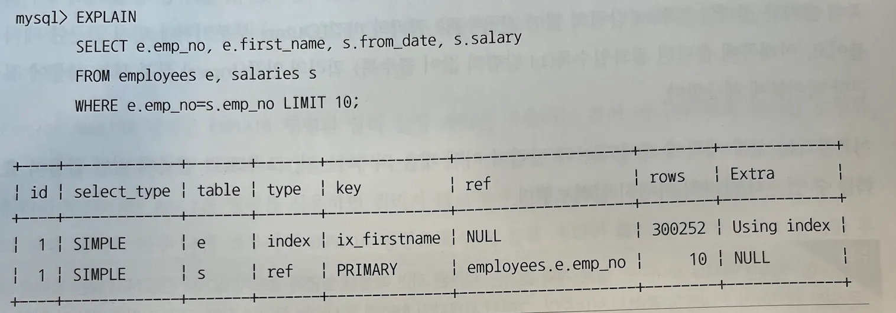
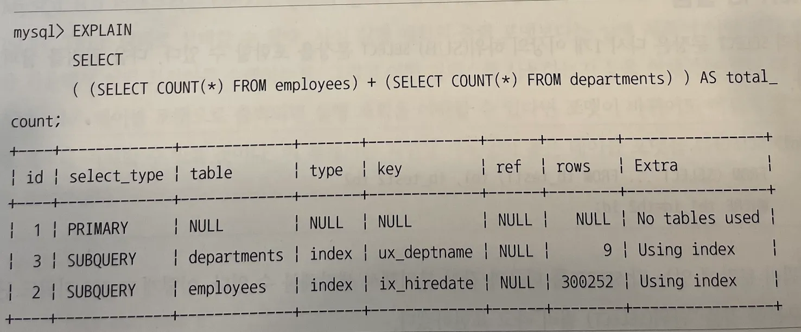

- 실행 계획 확인
  - MySQL 서버의 실행 계획은 DESC 또는 EXPLAIN 명령으로 확인
  - 실행 계획 출력 포맷
    - `EXPLAIN` or `EXPLAIN FORMAT = TRADITIONAL`
      - 테이블 형식으로 출력
    - `EXPLAIN + FORMAT=TREE` or `FORMAT=JSON`
      - Tree, Json 형태로 출력 (TREE는 안되는데??)
        ex) 어드민 상품 전체 조회
        - 쿼리
          ```sql
          EXPLAIN FORMAT = JSON
          SELECT P.-
          FROM Product P
                   JOIN Store S ON P.storeId = S.id
                   LEFT JOIN -
                   LEFT JOIN -
                   LEFT JOIN -
                   LEFT JOIN -
          WHERE TRUE
            AND P.discountRate BETWEEN - AND -
          GROUP BY P.id
          ORDER BY P.createDate DESC
          LIMIT 0, 100;
          ```
        - JSON 결과
          ```json
          {
            "query_block": {
              "select_id": 1,
              "cost_info": {
                "query_cost": "1351746.29"
              },
              "ordering_operation": {
                "using_temporary_table": true,
                "using_filesort": true,
                "grouping_operation": {
                  "using_filesort": false,
                  "nested_loop": [
                    {
                      "table": {
                        "table_name": "P",
                        ...
                      }
                    },
                    {
                      "table": {
                        "table_name": "S",
                        ...
                      }
                    },
                    {
                      ...
                    },
                    {
                      ...
                    },
                    {
                      ...
                    },
                    {
                      ...
                    }
                  ]
                }
              }
            }
          }
          ```
  - 쿼리의 실행 시간 확인
    - `EXPLAIN ANALYZE`
      - 실행 계획과 단계별 소요 시간 정보를 확인, EXPLAIN과 달리 실제 쿼리를 실행하고 사용된 실행 계획과 소요된 시간을 보여줍니다.
      - 시간이 아주 많이 걸리는 쿼리라면 EXPLAIN을 우선 실행한 후 어느 정도 튜닝한 후 명령을 실행
      - ANALYZE 결과
        ```sql
        /* 19단계: 최종적으로 상위 100개의 결과를 선택하여 반환. */
        -> Limit: 100 row(s)  (actual time=6018..6018 rows=100 loops=1)
            /* 18단계: 결과를 'P.createDate' 기준으로 내림차순 정렬. */
            -> Sort row IDs: P.createDate DESC, limit input to 100 row(s) per chunk  (actual time=6018..6018 rows=100 loops=1)
                /* 17단계: 임시 테이블 스캔. */
                -> Table scan on <temporary>  (cost=1.62e+6..1.62e+6 rows=76803) (actual time=5978..6009 rows=39339 loops=1)
                    /* 16단계: 집계 결과를 임시 테이블에 저장. */
                    ...
        ```
  - `EXPLAIN ANALYZE` vs `EXPLAIN + FORMAT=TREE`
    - `EXPLAIN ANALYZE`
      - 예상되는 행 수, 실제 처리된 행 수, 각 단계의 비용 추정치(cost estimates), 그리고 각 단계가 실제로 얼마나 걸렸는지 등의 상세한 실행 시간 정보를 제공
      - 쿼리 실행에 대한 실제 성능을 평가하는 데 더 적합
    - `EXPLAIN + FORMAT=TREE`
      - 쿼리가 어떻게 구성되었는지, 각 단계에서 어떤 작업이 수행되는지를 명확하게
      - 실제 쿼리를 실행하지 않고, 계획 단계의 정보만을 제공
      - 쿼리의 구조를 이해하는 데 더 적합
- 실행 계획 분석
  - EXPLAIN 명령의 결과로 출력되는 실행 계획이 어떤 접근 방법을 사용하여 최적화를 수행하는지, 그리고 어떤 인덱스를 사용하는지 이해하는 것이 중요하다.
    !https://blog.kakaocdn.net/dn/6q6wB/btrIlxPedVo/FAbFTT84t9wYKkwsg0d3m1/img.png
  - 표의 각 라인
    - 쿼리 문장에서 사용된 테이블(서브쿼리로 임시 테이블을 생성한 경우 그 임시 테이블까지 포함)의 개수만큼 출력
  - 실행 순서는 위에서 아래로 순서대로 표시
    - 출력된 실행 계획에서 위 쪽에 출력된 결과일수록 쿼리의 바깥(Outer) 부분이거나 먼저 접근한 테이블이고, 아래쪽에 출력된 결과일수록 쿼리의 안쪽(Inner) 부분 또는 나중에 접근한 테이블
  - id 칼럼
    - id 칼럼은 단위 SELECT 쿼리별로 부여되는 식별자 값
    - SELECT 문장은 하나인데, 여러 개의 테이블이 조인되는 경우는 id 값이 증가하지 않고 같은 id 값이 부여된다.
      - 실행 계획의 id 칼럼이 테이블의 접근 순서를 의미하지는 않음
  - **ID column**
    - 하나의 SELECT 문장은 다시 1개 이상의 하위 SELECT 문장을 포함할 수 있다
      ```sql
      SELECT ...
      FROM (SELECT ... FROM tb_test1) tb1, tb_test2 tb2
      WHERE tb1.id = tb2.id;
      ```
    - 위의 쿼리를 분리해서
      ```sql
      SELECT ... FROM tb_test1;
      SELECT ... FROM tb1, tb_test2 WHERE tb1.id = tb2.id;
      ```
      → **SELECT 쿼리별로 id column이 부여**, 위의 실행 계획에서는 최소 2개의 id값이 표시될 것
    - **서브 쿼리와 조인**
      - 하나의 SELECT 쿼리 내에서 여러 테이블이 조인될 경우, 그 조인된 테이블들은 동일한 **`id`** 값을 공유
        
      - 반면, 서브쿼리나 다른 복잡한 쿼리 구조에서는 각각 다른 **`id`** 값이 할당
        
    - **접근 순서**
      - **`id`** 컬럼 자체가 접근 순서를 직접적으로 의미 x
      - 정확한 실행 순서를 확인하려면 **`EXPLAIN FORMAT=TREE`**를 사용
