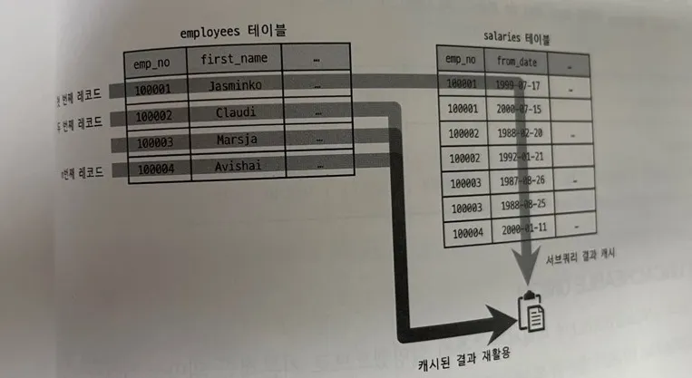

- 10.3.2~10.3.3
  10.3.2 select_type 칼럼

  - 각 단위 SELECT 쿼리가 어떤 타입의 쿼리인지 표시되는 칼럼

    10.3.2.1 SIMPLE

  - UNION이나 서브쿼리를 사용하지 않는 단순한 쿼리는 SIMPLE로 표시된다(쿼리에 조인이 포함된 경우도 마찬가지) 아무리 복잡한 쿼리도 SIMPLE인 단위 쿼리는 하나만 존재.
  - 일반적으로 제일 바깥 SELECT 쿼리의 select_type이 SIMPLE로 표시된다.

    10.3.2.2 PRIMARY

  - UNION이나 서브쿼리를 가지는 쿼리의 가장 바깥쪽에 있는 단위 쿼리는 PRIMARY로 표시된다.
  - SIMPLE과 마찬가지로 하나만 존재

    10.3.2.3 UNION

  - UNION으로 결합하는 단위 SELECT 쿼리 가운데 첫번쨰를 제외한 두 번째 이후 단위 쿼리는 UNION으로 표시
  - 첫 번째 SELECT는 UNION되는 쿼리 결과를 모으는 임시 테이블(DERIVED)가 표시된다

    10.3.2.4 DEPENDENT UNION

  - UNION이나 UNION ALL로 결합된 단위 쿼리가 외부 쿼리에 의해 영향을 받는 것을 의미
  - 내부 쿼리가 외부의 값을 참조해서 처리 될 때

  ```jsx
  SELECT * FROM EX WHERE EX.id IN (
  	SELECT EX2.id FROM EX2 WHERE EX2.name = 'test'
  	UNION
  	SELECT EX3.id FROM EX3 WHERE EX3.name = 'test'
  )

  where Ex.id = ex2.id
  ```

  10.3.2.5 UNION RESULT

  - UNION 결과를 담아두는 테이블을 의미한다.
  - 8.0부터 UNION ALL의 경우 임시테이블을 사용하지않음(나머지는 여전히 사용)
  - UNION RESULT는 단위 쿼리가 아니라 별도의 id 값은 부여되지 않는다.
    
  - table 에 표시되는건 어떤 쿼리의 조회 결과인지 id로 나타내는것

    10.3.2.6 SUBQUERY

  - FROM절 이외에서 사용되는 서브쿼리만을 의미한다.
  - FROM절에 이용된 서브쿼리는 DERIVED로 표시된다.(파생테이블)
  - 서브쿼리는 사용 위치에따라 각각 다른이름
    - SELECT에 이용되면 네스티드 쿼리
    - WHERE절은 서브쿼리
    - FROM절은 파생테이블
  - 반환하는 값에 따른 분류 - 스칼라: 하나의 값(컬럼이 단 하나인 레코드 1건)만 반환하는 쿼리 - 로우: 컬럼의 개수와 상관없이 하나의 레코드만 반환하는 쿼리

    10.3.2.7 DEPENDENT SUBQUERY

  - 의존 → 외부 SELECT 쿼리의 칼럼을 사용하는 경우

    10.3.2.8 DERIVED

  - FROM절에서 서브쿼리가 사용되면서 단위 SELECT 쿼리의 실행 결과로 메모리나 디스크에 임시 테이블을 생성하는 경우
  - 가능하다면 조인으로 해결할 수 있도록 쿼리를 바꿔주는 것이 좋다
  - 8.0버전에선 FROM절 서브쿼리도 많이 개선되어 잘 최적화해서 재작성 해주지만 그래도 조인을 추천

    10.3.2.9 DEPENDENT DERIVED

  - 8.0 부터는 FROM절 서브쿼리에서도 외부 컬럼을 참조할 수 있게 됐다
  - LATERAL JOIN 기능에서만 가능

    10.3.2.10 UNCACHEABLE SUBQUERY

  - 하나의 쿼리 문장에 조건이 똑같은 서브쿼리가 실행될 때는 이전의 실행 결과를 캐시했다가 재사용한다.
  - DEPENDENT SUBQUERY의 경우 바깥쪽 쿼리의 칼럼의 값 단위로 캐시해두고 사용
  - 그러나 캐시를 사용할 수 없는 경우 UNCACHEABLE로 표시된다. - 사용자 변수가 사용된 경우 - NOT-DETERMINISTIC 속성의 스토어드 루틴이 서브쿼리 내에 사용된 경우 - UUID() RAND() 와 같이 결과값이 호출할 때마다 달라지는 함수가 사용된 경우

    10.3.2.11 UNCACHEABLE UNION

  - 위와 동일

    10.3.2.12 MATERIALIZED

  - 서브쿼리 내용을 임시테이블로 구체화한 후 임시테이블을 조인하는 형태로 최적화 하는 경우
  - 9장에서 했다는데 잘 기억이 안나네.? ⇒ ?

    10.3.3 table 칼럼

  - mysql 실행계획은 단위 SELECT 기준이 아닌 테이블 기준으로 표시된다.

  ```jsx
  EXPLAIN SELECT NOW();
  EXPLAIN SELECT NOW() FROM DUAL;
  ```

  - 별도의 테이블을 사용하지 않는 SELECT 쿼리의 경우 table 칼럼에는 NULL로 표시된다.
    - 실제 DUAL 이라는 테이블은 존재하지 않지만 내부적으로 DUAL이 있는 것처럼 작동한다.
    - 되도록이면 DUAL 예약어는 사용하지 말자 (백틱으로 감싸서 사용해야 한다.)
      
      
  - id, select_type, table 칼럼만으로 실행계획 분석 해보기
    1. 첫 번째 라인의 테이블이 라는 것으로 보아 id 2번 라인이 먼저 실행되고 그 결과가 임시테이블로 준비 되어야 한다.
    2. 세 번째 라인에서 select_type 이 DERIVED 인 것으로 보아 dept_emp 테이블을 읽어서 파생 테이블을 생성함을 알 수 있다.
       - 세 번째 라인에서 생성된 결과를 첫 번쨰 라인에서 사용한다.
    3. 첫 번째 라인과 두 번째 라인의 id 가 같다는 것은 2개의 테이블이 조인됨을 추측할 수 있고 1번 라인의 테이블이 먼저 표시되었으므로 derived 2가 드라이브 테이블 e 가 드리븐 테이블임을 알 수 있다.
