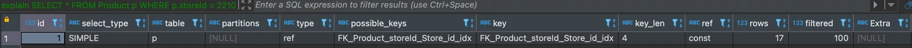
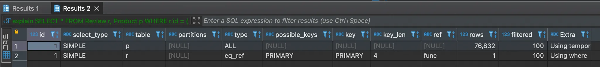
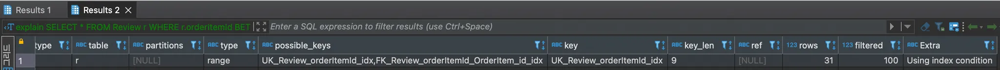
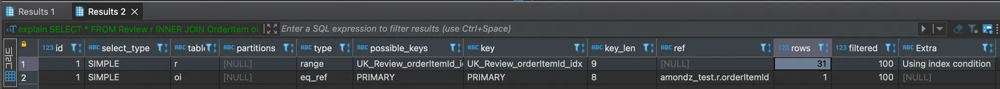
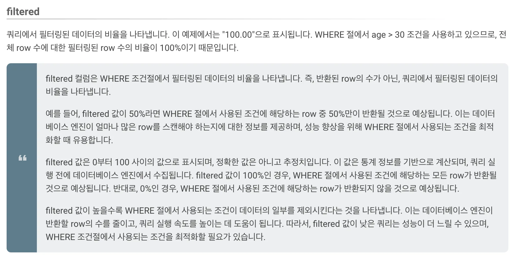
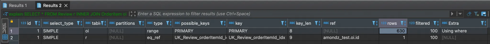
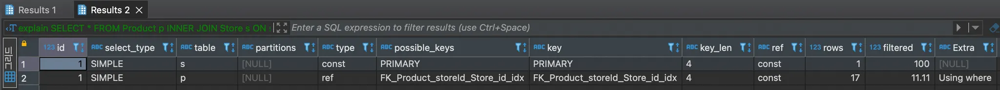

### 10.3.6 possible_keys 칼럼

- 옵티마이저가 판단하기에 최적의 실행 계획에 사용될 수 있는 인덱스 목록
- 쿼리 튜닝 시 - 모든 인덱스가 포함될 경우도 있기 때문에 그냥 무시해도 된다.

### 10.3.7 key 칼럼

- 최종적으로 실행계획에 선택된 인덱스
- type 칼럼이 index_merge가 아닌 경우에는 반드시 테이블 하나 당 하나의 인덱스만 이용할 수 있다. ALL일 경우 key 칼럼은 NULL이 된다.
- 쿼리 튜닝 시 - 의도한 인덱스가 출력되는지 확인해야한다.

### 10.3.8 key_len 칼럼

- 사용된 인덱스의 레코드에서 사용된 바이트 값
- 인덱스가 여러개 사용되었다면 두 레코드에서 사용된 바이트 값이 합산되서 보여진다.(450p 참고)
- NULL이 허용될 경우 바이트 값에 + 1바이트를 추가로 사용한다. ex) 아래 예제에서 storeId가 NULL이 허용된 경우, key_len = 5(4 +1)
- example
  ```sql
  explain
  SELECT *
  FROM Product p
  WHERE p.storeId = 0;
  ```
  
  - key_len = 4
    - key가 된 storeId 인덱스 데이터 타입은 INT UNSIGNED로 4byte 이기 때문에 key_len은 4가 된다.
  - 만약 key의 타입이 CHAR(4)인 경우,
    - utf8mb4 문자 1개는 1~4바이트로 가변적이나 MySQL 서버는 공간 할당을 위해 4바이트로 고정하고 계산한다.
    - 따라서 4바이트씩 문자 4개로 key_len = 16(4 \* 4)

### 10.3.9 ref 칼럼

- = 비교 조건 사용 시 어떤 값이 제공되었는지 보여준다.
- 쿼리 튜닝 시 - 크게 신경쓰지 않아도 된다.(보통 상수값 지정 시 const) 단, func 출력 시 값을 그대로 사용하지 않고 사용자가 명시적으로 혹은 MySQL서버가 내부적으로 값을 변환하였다는 의미로 가급적이면 func를 피해 최대한 조인 칼럼의 타입은 일치시키는 것이 좋다.
- example
  ```sql
  SELECT *
  FROM Review r, Product p
  WHERE r.id = (p.id - 1)       // 명시적인 값의 변환
  ORDER BY r.id DESC
  LIMIT 1;
  ```
  

### 10.3.10 rows 칼럼

- 옵티마이저가 예측한 읽고 체크해야할 레코드 건수 → 조건에 일치하는 레코드 건수(반환하는 레코드 건수 아님)
- 쿼리 튜닝 시 - 일치하지 않은 경우가 많다. 정확한 값은 아님을 인지하자.

### 10.3.11 filtered 칼럼

- 인덱스를 사용하지 못하는 레코드 건수
- example
  ```sql
  explain
  SELECT *
  FROM Review r
  WHERE r.orderItemId BETWEEN '0' AND '0';
  ```
  
  - rows = 31 → 인덱스 조건에 일치하는 레코드 건수
  - filtered = 100 → rows 중 100% 인덱스를 사용함
- example2
  ```sql
  explain
  SELECT *
  FROM Review r
  INNER JOIN OrderItem oi ON oi.id = r.orderItemId
  WHERE oi.id BETWEEN '0' AND '0';
  ```
  
  - Review 테이블에서 rows = 31개 조회 후 100%가 OrderItem과 조인됨
    
  - OrderItem 테이블에서 rows = 1은 하나의 Review 당 1개의 데이터가 조회되었다는 뜻일까? ⇒ 하단에 아 그러네 참고
  ```sql
  explain
  SELECT /*+ JOIN_ORDER (oi, r) */ *        // 옵티마이저에게 조인 순서 권고
  FROM Review r
  INNER JOIN OrderItem oi ON oi.id = r.orderItemId
  WHERE oi.id BETWEEN '0' AND '0';
  ```
  
  - OrderItem 테이블에서 rows = 630개 조회 후 100%가 Review와 조인됨
  - Review 테이블에서 rows = 1은 하나의 OrderItem 당 1개의 데이터가 조회되었다는 뜻일까?
  - 아 그러네‼️
    - 후기 이미지가 2개 첨부된 후기 1개(임의로 url을 넣은거라 서버에 이미지가 없어서 이미지 조회가 안돼는 것일 뿐 느려서 아님)
      
    - 하나의 Review에 ReviewAttachment가 총 2개 조회되는 것을 확인할 수 있음(rows = 2)
      
- 이해 안돼는 example
  ```sql
  // 총 13개의 레코드가 조회됨
  explain
  SELECT *
  FROM Product p
  INNER JOIN Store s ON s.id = p.storeId
  WHERE s.id = 2210 AND p.createDate BETWEEN '2023-01-01' AND '2023-12-01';
  ```
  
  - Store 테이블
    - rows = 1, filtered = 100% → 하나의 레코드가 조인됌(1 \* 1 = 1)
  - Product 테이블
    - rows = 17, filtered = 11.11% → 하나의 레코드가 조인됌?? (17 \* 0.1111 = 1.8887???)
    - 얘는 무시해야되나?

### 10.3.12 Extra 칼럼

- 쿼리 실행 계획에서 성능에 관련된 중요한 내용이 표시된다.
- 굉장히 올 수 있는 친구들이 많음..
- const row not found → const 방법으로 읽었지만 만족하는 레코드가 없는 경우
- Deleting all rows → DELETE 문장 실행계획에 보임. but, MySQL 8.0부터는 더 이상 표시되지 않음.
- Distinct → 조인하지 않아도 되는 데이터들은 무시함.
- FirstMatch → 첫 번째로 일치하는 한 건만 검색
- Full scan on NULL key → 조건문에서 값이 Null이 되어 풀 스캔을 해야만 하는 경우
  - NULL이 허용된 컬럼에서만 발생함
    ```sql
    SELECT
    ...
    WHERE col1 IN (SELECT col2 FROM ...);   // 이 문장에서 col1에 NULL값이 대입된 경우(NULL IN (SELECT col2 FROM ...))
    ```
  - NULL이 허용되었지만 NULL 비교 규칙을 무시해도 된다면 옵티마이저에게 알려주면 된다!
    ```sql
    SELECT *
    FROM ...
    WHERE col1 IS NOT NULL AND col1 IN (SELECT col2 FROM ...);
    ```
- Impossible HAVING → HAVING 조건에 만족하는 레코드가 없는 경우
