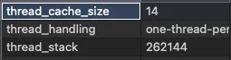
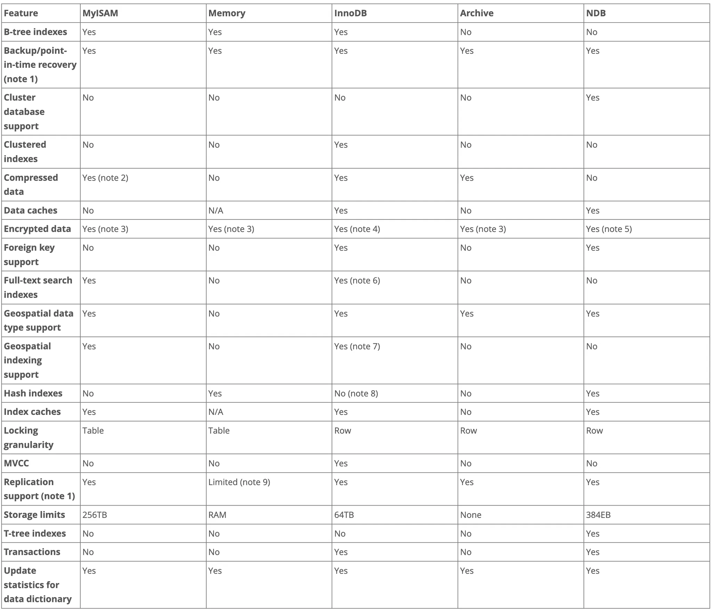

- 1.1~1.5

  - mysql 아키텍쳐 구조

    - mysql 엔진 - 커넥션 핸들러(접속 및 쿼리 요청 처리), sql 파서 및 전처리기, 옵티마이저(쿼리 최적화 실행)
    - 스토리지 엔진 - 여러 스토리지 엔진 동시 사용 가능
      - 핸들러 API - 각 요청에 이용되는 api (엔진이든 스토리지든)

  - 포그라운드 스레드(클라이언트 스레드)
    - 커넥션 별로 스레드 하나인 방식 ↔ 스레드 하나가 여러 커넥션요청을 전담하는 방식(스레드풀)
    - 최소 접속된 클라이언트 수 이상 존재 (일정 개수 이상이 되지 않도록 스레드캐시에 관리)
      
    - InnoDB 기준 데이터 버퍼나 캐시까지만 포그라운드에서 처리.
      나머지 버퍼로부터 디스크 기록은 백그라운드 스레드가 처리
  - 백그라운드 스레드
    - InnoDB 기준
      - 인서트 버퍼 병합
      - 로그를 디스크로 기록 (Log thread) - 트랜잭션 로그를 유지하는데 이용되어 중요
      - InnoDB버퍼 풀의 데이터를 디스크에 기록 (write thread)
      - 데이터를 버퍼로 읽어 옴
      - 잠금 혹은 데드락을 모니터링
    - read write thread 둘 다 4 로 설정 (write가 상대적으로 더 중요)
  - 메모리 할당 및 구조
    - 글로벌 메모리
    - 로컬 메모리
      - (클라이언트스레드)스레드 별로 독립적 - 스레드 당 커넥션이 여러개일수도 있다
      - 필요하지 않으면 할당되지 않을 수 있음
      - 커넥션이 열린동안 유지되는 공간도 있고 쿼리를 실행하는 순간만 할당되는 공간도 있음
  - 스토리지 엔진
    
    - 대부분의 작업은 MySQL 엔진 영역에서 처리가 되며 "데이터 읽기/쓰기" 작업만 스토리지 엔진이 처리
  - ## 컴포넌트(구플러그인)

- 스토리지 엔진 비교

스토리지 엔진별 성능 비교([참고](https://dev.mysql.com/doc/refman/5.7/en/storage-engines.html))
