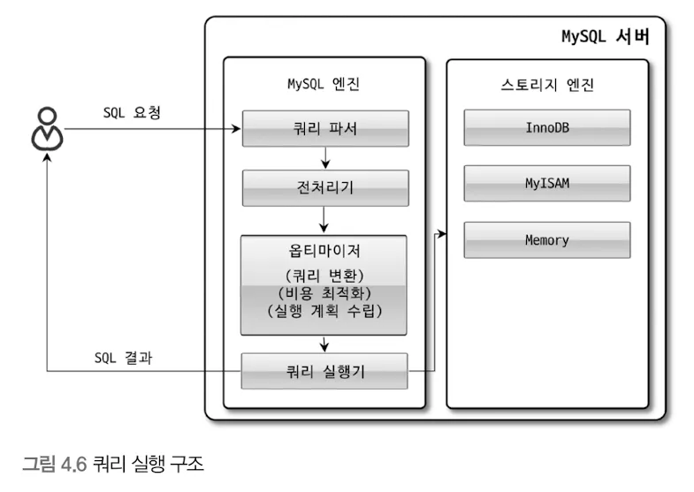
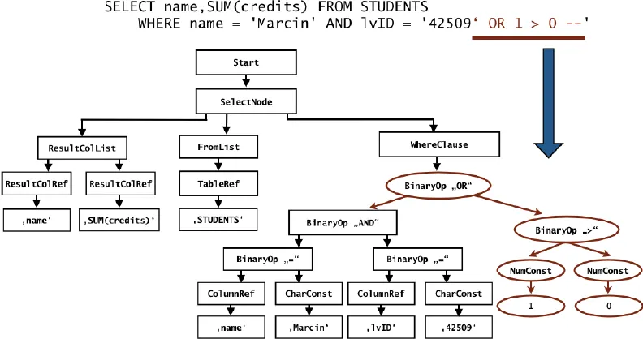
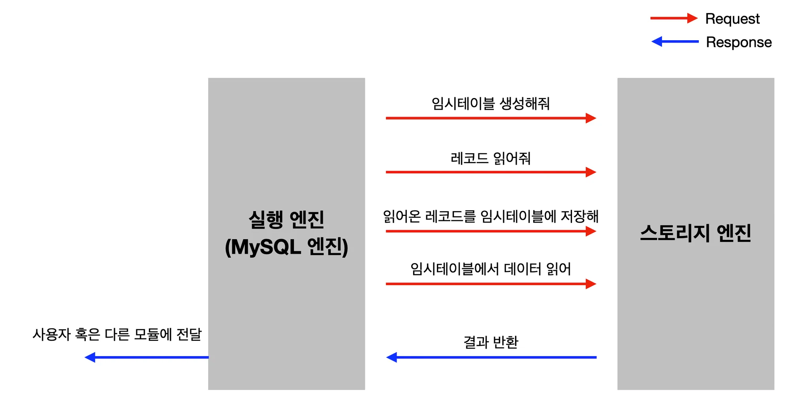
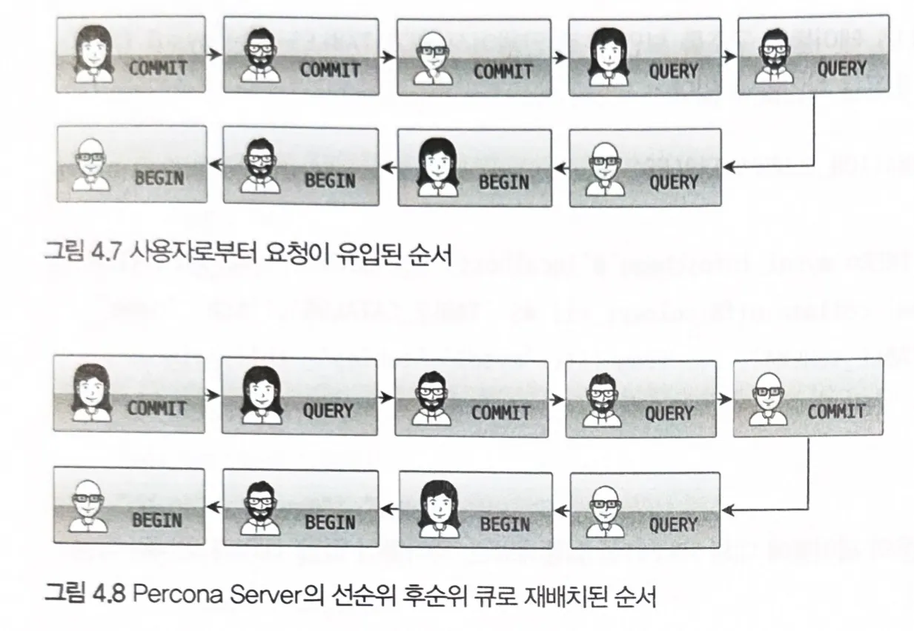

### 쿼리 실행 구조

| 쿼리 파서 | - 쿼리를 토큰으로 분리해 Parser Tree를 구성

- | 기본 문법 오류 체크 |
  | ------------------- | -------------------------------------------- |
  | 전처리기            | - Parser Tree를 기반으로 쿼리 문장 구조 체크 |
- 객체(내장함수 등) 존재 여부 및 접근 권한 체크 |
  | 옵티마이저 | - 효율적인 쿼리문 생성이 실제적으로 일어나는 곳
- 쿼리 변환, 비용 최적화, 실행 계획 수립 결정 |
- Parser Tree Example
  
- 실행 엔진
  - 핸들러에 요청해서 받은 결과를 또 다른 핸들러 요청의 입력으로 연결하는 역할
    
- 핸들러 = 스토리지 엔진
  - MySQL 실행 엔진의 요청에 따라 데이터를 디스크로 저장 및 읽음
  - 핸들러 API : 쿼리 실행기에서 각 스토리지 엔진에게 데이터 쓰기, 읽기 요청할 때 사용되는 API

### 쿼리 캐시

- 동시 처리 성능 저하 문제로 MySQL 8.0에서 완전히 제거된 기능
- SQL 실행 결과를 메모리에 캐시했다가 테이블의 데이터가 변경되면 삭제

### 스레드 풀

- 동시 처리 요청이 많아도 MySQL 서버의 CPU가 제한된 개수의 스레드 처리만 집중할 수 있도록 서버 자원(스레드) 소모 줄임
- 불필요한 컨텍스트 스위치를 줄여 오버헤드를 낮출 수 있다.
  - ex) 스레드 풀의 스레드 개수 = 10개라면 요청 100개가 들어왔을 때 처음 10개에 대해서만 스레드를 배정하고 나머지는 큐에 넣어서 대기시킨다.
- MySQL 엔터프라이즈 에디션, Percona MySQL 서버에서 제공
  - Percona MySQL
    - MySQL에서 근무하던 엔지니어들이 설립한 MySQL 컨설팅 전문 회사
    - MySQL의 안정성, 편의성 극대화가 목적(쿼리 성능 극대화)
    - https://blog.embian.com/3
- Percona Server 스레드 풀
  - 일반적으로 CPU 코어 개수만큼 스레드 생성
  - 스레드 처리를 위한 시스템 변수
    | 시스템 변수 | 역할 |
    | ------------------------- | ------------------------------------------------------------------------------------------------------------------------------------------------- |
    | thread_pool_size | 스레드 그룹 개수 |
    | thread_pool_oversubscribe | MySQL 서버 요청을 수행할 수 있는 스레드가 없는 경우 thread_pool_oversubscribe으로 설정된 값 만큼 스레드 추가되어 처리 |
    | thread_pool_stall_limit | 모든 스레드 그룹이 일을 처리 중이라면 thread_pool_stall_limit에 설정된 밀리초 만큼 기다리다 스레드가 작업을 못 마치면 새로운 스레드 생성하여 추가 |
    | thread_pool_max_threads | 전체 스레드 풀에 있는 최대 스레드 개수 |
  - 선순위/후순위 큐 제공
    - 선순위 혹은 후순위로 작업 재배치를 통해 먼저 시작된 트랜잭션 SQL을 빨리 처리하여 자원의 잠금을 빠르게 해제
    - 잠금 경합 감소
      

### 트랜잭션 지원 메타데이터

- 메타데이터 : DB 서버에서 테이블 구조 정보 및 스토어드 프로그램 등의 정보
  - 스토어드 프로그램
    - MySQL 내에서 프로그래밍 언어와 같은 기능을 제공하는 프로그램
    - 즉, 프로그래밍 기능을 사용해 쿼리문을 더 편리하게 사용한다.
    - 테이블처럼 DB 내부에 저장
- MySQL 5.7 까지
  - 파일 기반 메타데이터로 관리
  - 테이블 생성 도중 MySQL 서버가 비정상적으로 종료된 경우 일관되지 않은 상태로 남는 문제가 있음
- MySQL 8.0
  - InnoDB 테이블에 메타데이터 저장 → 시스템 테이블(서버 작동에 필요)
  - 트랜잭션 기반 InnoDB 덕분에 비정상적인 종료 시에도 일관성 유지(성공 or 실패 케이스만 존재)
  - ibd2sdi 유틸리티 통해 innoDB 테이블스페이스에서 스키마 정보 추출 가능
