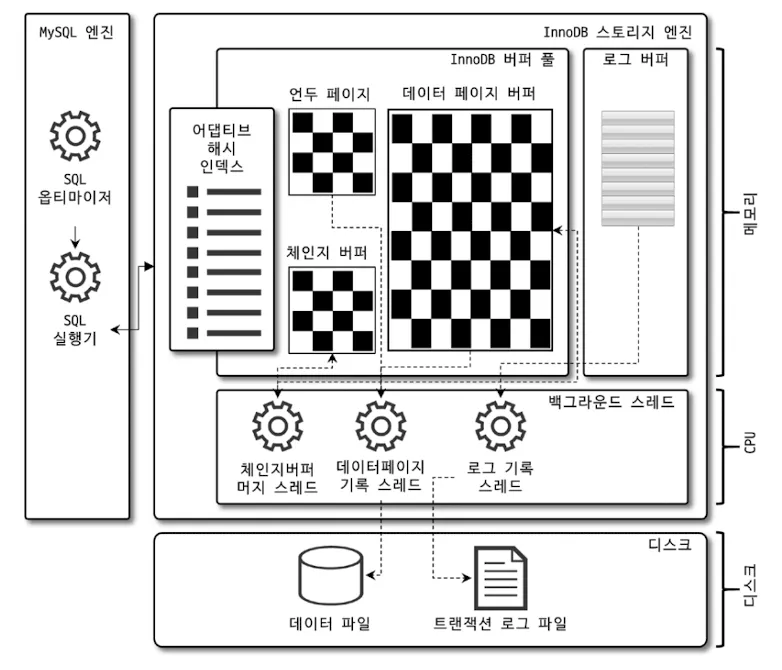
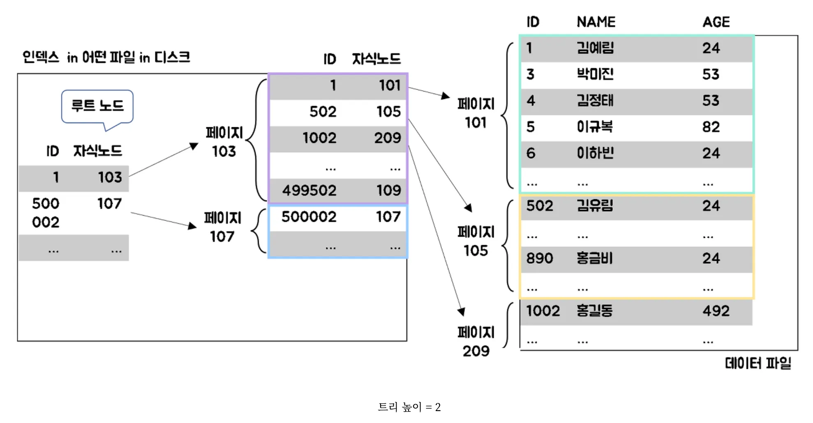
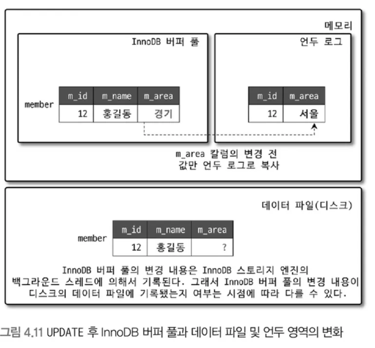
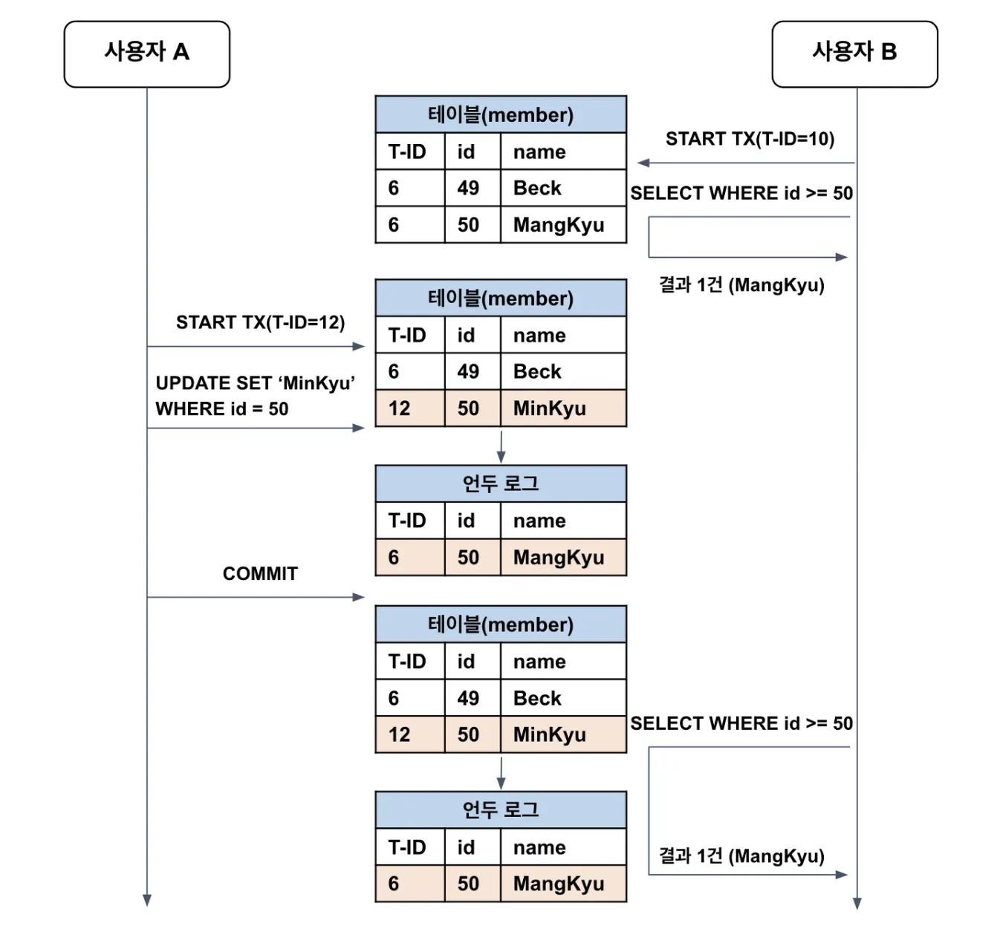
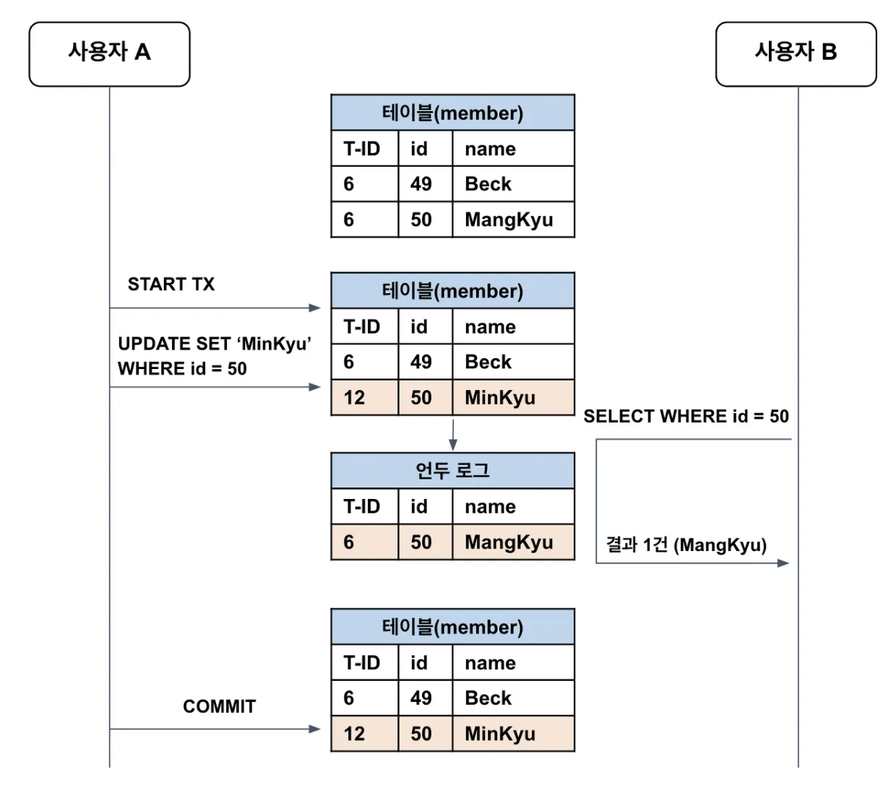
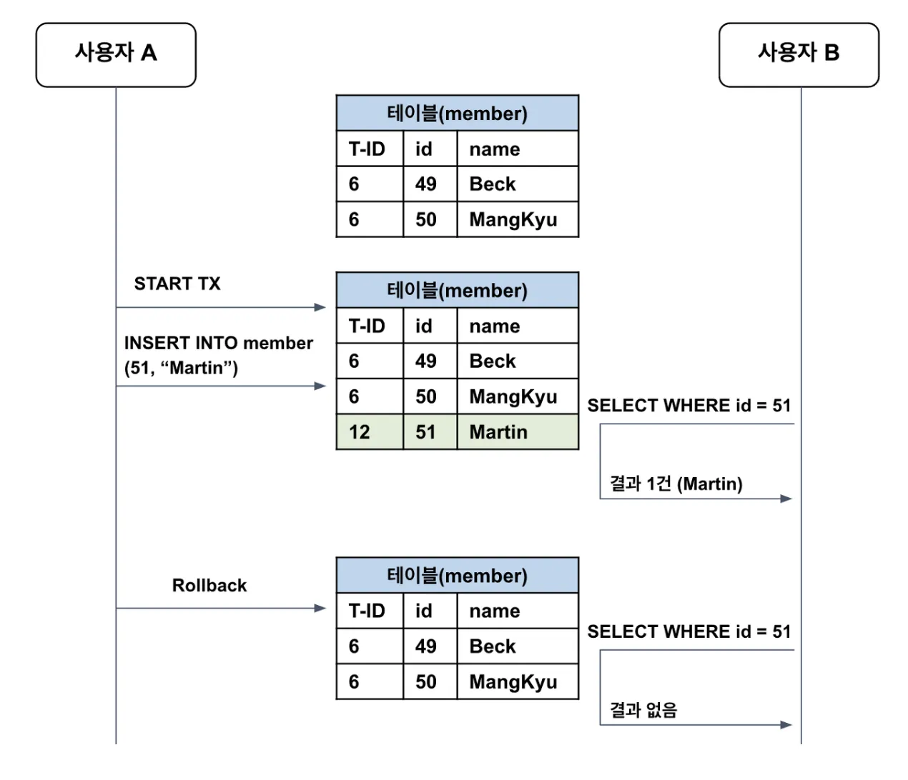

- InnoDB 구조
  
- 클러스터링
  - InnoDB
    - 레코드 기반 잠금 제공
    - primary key를 기준으로 클러스터링(클러스터링 인덱스)되어 range scan이 빠르다. 즉, 검색 속도가 빠르다.
      - 클러스터링
        - 유사한 데이터끼리 묶는다
        - 즉, primary key를 기준으로 묶는 방식이 클러스터링 인덱스
        - 클러스터링 인덱스가 `없는` 경우
          
          - 입력되는 데이터가 ID(primary key) 기준으로 정렬되어 저장되지 않는다.
          - 만약 1억개의 데이터들 중 1억 번째의 데이터에 접근을 원할 경우, 한 페이지당 500개의 레코드를 저장하고 있다면 20만번 페이지를 조회해야 데이터를 찾을 수 있다.
        - 클러스터링 인덱스가 `있는` 경우
          
          - 입력되는 데이터가 ID(primary key) 기준으로 정렬되어 저장된다.
          - 클러스터링 인덱싱이 되어 트리 구조로 정렬되어 아래 예제와 같이 루트노드, 자식노드, 리프노드 총 3번의 디스크 I/O 작업이 일어난다.
            
  - MyISAM
    - 클러스터링 인덱스 지원 안함
- 외래키 지원

  - innoDB

    - 부모/자식 테이블이 인덱스로 연결되어있음 ⇒ 데드락 발생 증가
    - DB 긴급조치 필요 시 foreign_key_checks 변수를 비활성화하여 외래키 체크를 중지시킬 수 있다.
    - 단, 외래키가 깨지지 않아야하고 비활성화 시 On Delete CASCADE, On Update CASCADE 무시됨
      <aside>
      💡 외래키 체크 중지 기능은 반드시 작업 세션에서만 진행해야하고 작업 완료 시 세션 종료 혹은 외래키 체크 활성화
      ⇒ 문제 발생 시 활용 가능한 변수 중 하나일 듯함(하지만 좋지 않은 상황이므로 미리미리 조심..)

      </aside>

- MVCC(Multi Version Concurrency Control)
  - InnoDB
    
    - 언두로그를 이용해 잠금 없는 일관된 읽기 지원
    - commit 실행 시 InnoDB 버퍼 풀 데이터를 영구적으로 디스크에 저장
    - Rollback 실행 시 데이터 이동 과정
      - 언두 로그 → innoDB 버퍼 풀 → 언두로그 내용 삭제(사용하는 트랜잭션 없을 때)
- MySQL 격리 수준에 따른 데이터 읽기

  - MySQL 격리 수준
    (참고 : https://mangkyu.tistory.com/299)
      <aside>
      💡 Amondz prod 격리 수준 : Read-Committed
      
      </aside>
      
      - `Serializable` : 가장 엄격한 격리 수준. 트랜잭션이 순차적으로 처리되어야하여 성능이 떨어진다.
      - `Repeatable-Read` : 변경 전의 레코드를 언두 공간에 백업하여 한 트랜잭션 내에서만 동일한 결과를 보장한다.
          
          
          
      - `Read-Committed` : commit된 데이터만 조회.
          
          
          
      - `Read-Uncommitted` : commit되지 않은 데이터도 조회.
          - dirty read 발생 가능
              
              

  - 데이터 읽는 위치
    - Serializable, Repeatable-Read, Read-Committed ⇒ 언두로그 데이터 반환
    - Read-Uncommitted ⇒ InnoDB 버퍼풀의 변경된 데이터 반환
  - 데이터 읽기 잠금

    - Serializable ⇒ Select 작업도 잠금 대기
    - Read-Committed, Read-Uncommitted, Repeatable-Read ⇒ Select 작업은 잠금 대기 없이 실행
      <aside>
      💡 언두로그를 효율적으로 활용하기 위해 트랜잭션 시작 시 commit 혹은 rollback을 통해 최대한 빨리 완료하는 것이 좋다.

      </aside>

- 자동 데드락
  | 환경변수 | 내용 | prod DB 설정상태 |
  | ------------------------ | ----------------------------------------------------------------------- | ---------------- |
  | innodb_table_locks | 테이블 레벨 잠금 감지 | ON |
  | innodb_deadlock_detect | 데드락 감지 | ON |
  | innodb_lock_wait_timeout | 데드락 상황에서 일정 시간 소요 시 자동으로 요청 실패 후 에러메시지 반환 | 240s |
- 자동화 자동 복구

  - innodb_force_recovery 환경변수의 1-6까지의 값을 통해 자동 복구
  - 환경변수의 값이 커질 수록 데이터 손실 가능성 증가 및 복구 가능성 저하
    <aside>
    💡 최악의 상황은 피할 수 있도록 데이터 손상을 최소화하자

    </aside>
