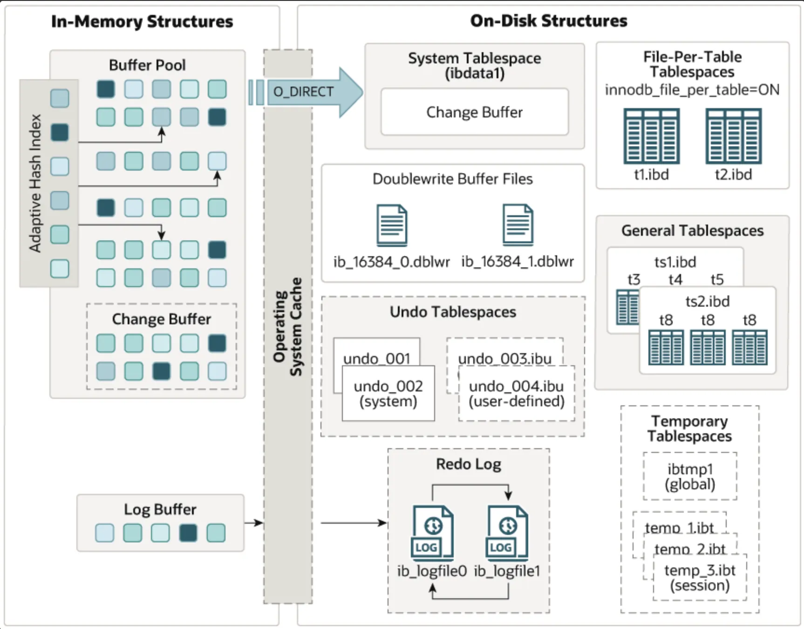

- 체인지 버퍼
  
  - 변경 작업을 할 때 인덱스 페이지를 디스크에서 읽어야 하는 경우 이용하여 성능 향상
  - 데이터 변경은 해당 테이블에 포함된 인덱스도 업데이트 해야하는데 인덱스가 여러개 존재한다면 성능이 저하될 수 있음.
  - InnoDB는 변경할 인덱스 페이지가 버퍼 풀에 있다면 바로 업데이트를 수행하지만, 없다면 체인지 버퍼에 저장해두고 결과를 반환한다. 그 후 체인지 버퍼에 임시 저장된 인덱스 레코드 조각을 버퍼 머지 스레드라는 백그라운드 스레드에 의해 병합한다.
  - 8.0부터는 insert update delete모두 버퍼링 지원
- 리두 로그
  - 트랜잭션 4가지 요소중 영속성과 가장 연관됨. 서버가 비정상적으로 종료됐을때 기록되지 못한 데이터를 잃지 않게 해주는 안정장치.
    1. 커밋됐지만 데이터 파일에 기록되지 않은 데이터 - 그냥 리두로그에서 복사하기만 하면됨.
    2. 롤백됐지만 데이터 파일에 이미 기록된 데이터 - 언두 로그의 내용을 가져와서 복사해야 하지만 리두 로그도 필요하다(커밋인지 롤백인지 실행 중간이었는지 확인하기 위해서라도)
  - 로그 버퍼
    - 변경 작업이 매우 많은 서버의 경우 리두 로그의 기록 작업이 성능 저하로 이어질 수 있음. 리두 로그 버퍼링을 이용하는데 이때 로그 버퍼 이용
  - 리두 로그 아카이빙
    - 8.0 버전 부터는 리두 로그 아카이빙 기능을 지원. 리두 로그가 덮어 쓰인다고 해도 백업이 실패하지 않도록 하는 기능
  - 8.0부턴 리두로그 수동 비활성화가 가능 (비추천, 차라리 flush_log_at_trx_commit을 변경하자)
- 어댑티드 해시인덱스
  - InnoDB 스토리지 엔진에서 사용자가 자주 요청하는 데이터에 대해 생성하는 해시 인덱스
  - B-Tree 검색 시간을 줄여주기 위해 도입.
  - 인덱스 키 값(Btree 고유번호 + 실제 Btree키 값 // 유니크한 값) + 데이터 페이지 주소(실제 키 값이 저장된 데이터 페이지의 메모리 주소)
  - 성능 향상에 크게 도움이 되지 않는 경우
    - 디스크 읽기가 많은 경우
    - 특정 패턴의 쿼리가 많은 경우(LIKE 패턴 검색이나 조인)
    - 매우 큰 데이터를 가진 테이블의 레코드를 폭넓게 읽는 경우
  - 성능 향상에 도움이 되는 경우
    - 디스크의 데이터가 InnoDB 버퍼 풀 크기와 비슷한 경우(디스크 읽기가 많지 않은 경우)
    - 동등 조건 검색(동등 비교와 IN 연산자)이 많은 경우
    - 쿼리가 데이터 중에서 일부 데이터에만 집중되는 경우
  - 꼭 도움이 되진않는다. 메모리도 차지하고 일단 활성화 되면 검색 동작이 추가되며, 데이터 변경시 어댑티드 해시 인덱스도 전부 관리해줘야 한다.
  - 정확한 판단을 위해 서버의 상태값들을 살펴보아야 한다.
- 스토리지 엔진 비교
