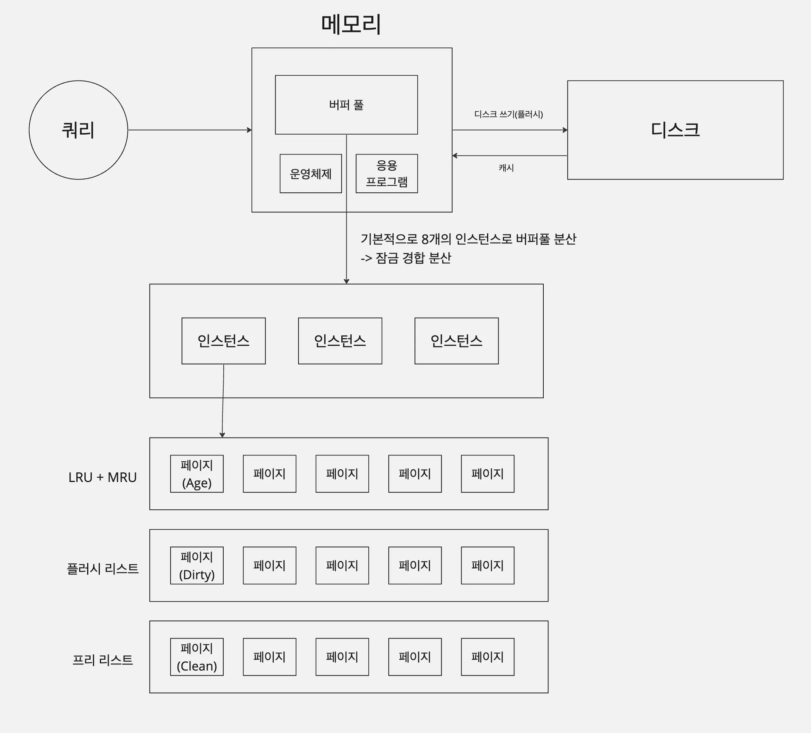
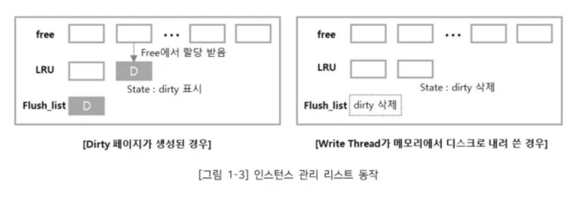

- 버퍼풀 구조
  
  
  [참고](https://s-core.co.kr/insight/view/mariadb-%EC%84%9C%EB%B2%84-%EB%AA%A8%EB%8B%88%ED%84%B0%EB%A7%81-%EB%B0%8F-%EC%84%B1%EB%8A%A5-%EC%B5%9C%EC%A0%81%ED%99%94-innodb-buffer-pool-1%EB%B6%80/)
- 성능

  1. 캐시성능
     1. 메모리 용량을 늘려서 데이터를 캐시할 수 있는 공간이 늘어나면 성능 증가
  2. 버퍼 성능

     1. 리두로그와의 관계성이 중요하다는데 이해하지 못함

     ](image-17.png)

     [참고](https://s-core.co.kr/insight/view/mariadb-%EC%84%9C%EB%B2%84-%EB%AA%A8%EB%8B%88%ED%84%B0%EB%A7%81-%EB%B0%8F-%EC%84%B1%EB%8A%A5-%EC%B5%9C%EC%A0%81%ED%99%94-innodb-buffer-pool-1%EB%B6%80/)

- 플러시
  - 버퍼풀의 데이터 변경 사항을 디스크에 반영하는 것
  - 플러시 리스트 플러시
    - 더티페이지를 디스크에 반영
    - 버퍼풀의 더티페이지를 저장할 수 있는 크기가 증가할수록 디스크 쓰기의 횟수 감소(성능 증가)
    - 더티페이지 보관 비율의 최대치에 도달하면 갑작스러운 디스크쓰기가 발생할 수 있음 → 주기적으로 디스크쓰기를 하여 더티페이지를 특정 비율로 유지하는 것이 중요(너무 낮을 비율로 유지하면 잦은 디스크 쓰기 발생하기 때문에 적정 비율 유지 중요 → 어뎁티브 플러시 알고리즘)
  - LRU 리스트 플러시
    - 사용빈도 낮은 페이지 디스크로 동기화(어떤걸 동기화 하는건지 모르겠음) → 클린 페이지 프리 리스트로 관리
- 워밍업
  - 디스크 데이터를 버퍼 풀에 적재하는 것
  - 데이터 베이스를 재시작해야할 때 버퍼풀을 백업하는 것으로 워밍업 성능 개선
- 더블 라이트 버퍼
  - 디스크 쓰기 해야 하는 페이지들중 일부만 디스크에 반영 되었을 상황(partial page)에 대비하여 더블 라이트 버퍼에 해당 페이지 리스트들 임시 보관
- 언두로그
  데이터 변경 이전 데이터를 보관
  목적
  - 트랜젝션 백업용
