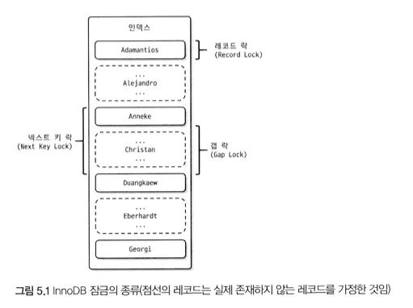

- InnoDB 스토리지 엔진 잠금
  
  mysql에서 제공하는 잠금과 별개로 엔진 내부에서 레코드 기반 잠금 방식을 탑재해서 동시성 처리를 제공. information_schema를 이용해서 잠금, 잠금 대기 트랜잭션 등을 조회 가능. performance Schema도 이용 가능
    <aside>
    💡 InnoDB는 잠금 정보가 작은 공간으로 관리되어 락 에스컬레이션이 발생하지 않는다.
    락 에스컬레이션: 레코드 락 → 테이블 락 방향으로 락의 수준이 올라가면서 많은 수의 작은 잠금을 적은 수의 큰 잠금으로 올리는 프로세스.
    동시성 경합 가능성이 올라가게 되고 동시성 처리 성능이 떨어진다.
    
    </aside>
    
    - 레코드 락
        - 레코드 자체를 잠그는 락. InnoDB는 레코드가 아닌 인덱스의 레코드를 잠근다.
        - 인덱스가 없는 테이블도 내부적으로 생성된 클러스터 인덱스를 이용해 잠금
        - PK 또는 유니크 인덱스 변경 작업에 사용
    - 갭 락
        - 레코드가 아닌 인접한 레코드 사이의 간격만을 잠그는 락. 넥스트 키 락의 일부로 활(?)
    - 넥스트 키 락
        - 레코드 락과 갭 락을 합쳐놓은 형태의 잠금. 해당 레코드와 인접된 레코드를 잠금으로 Phantom Rows 현상을 막을 수 있다.
        - 바이너리 로그에 기록되는 쿼리가 레플리카 서버에 실행될 때 소스 서버에서 만들어 낸 결과와 동일하도록 보장하는 것이 목적.
        - 바이너리 로그포맷을 row형태로 바꿔서 넥스트 키 락이나 갭 락을 줄이는 것이 좋다.
        
        <aside>
        💡 phantom rows:
        
        트랜잭션 수행중 다른 트랜잭션이 생성한 Row가 갑자기 나타나는 것.
        
        REAPEATABLE-READ 격리 수준을 사용해야함
        
        </aside>
        
    - 자동 증가 락
        - AUTO_INCREMENT 칼럼이 사용된 테이블에 여러 레코드가 INSERT 되는 경우, 각 레코드는 중복되지 않고 저장된 순서대로 증가하는 일련번호 값을 가져야 함.
        - 내부적으로 AUTO_INCREMENT 락이라고 하는 잠금을 이용. (하나만 존재) 값이 증가하면 절대 줄어들지 않는 이유가 이 잠금을 최소화하기 위함이다.
        - 명시적으로 해제하거나 획득 불가.
        - innodb_autoinc_lock_mode
            - 0
            - 1: 연속모드
            - 2: 인터리빙 모드
            
            
            
    - 인덱스와 잠금
        -
