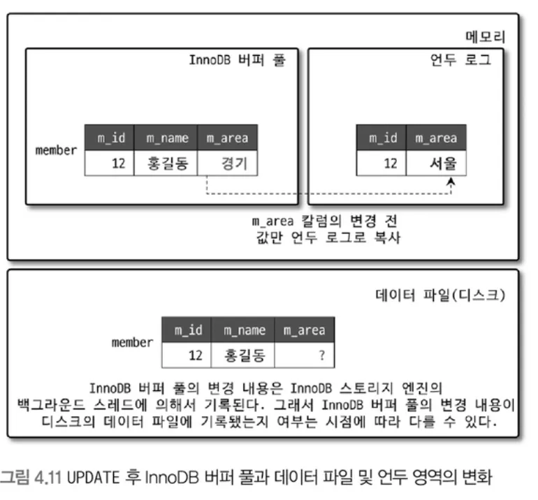
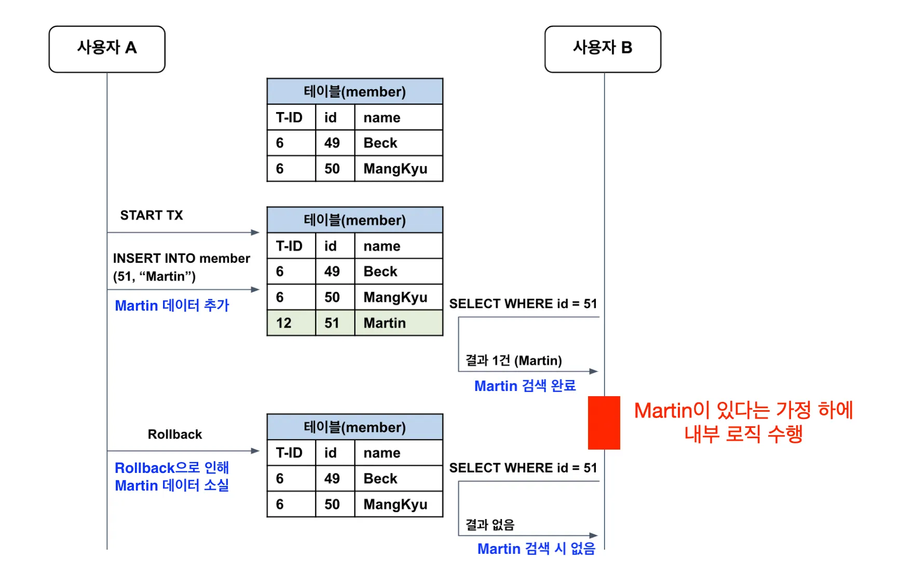
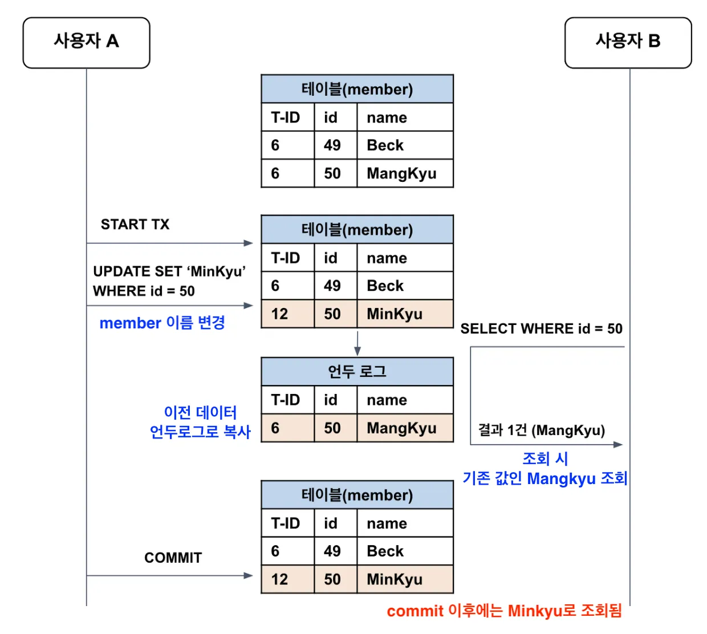
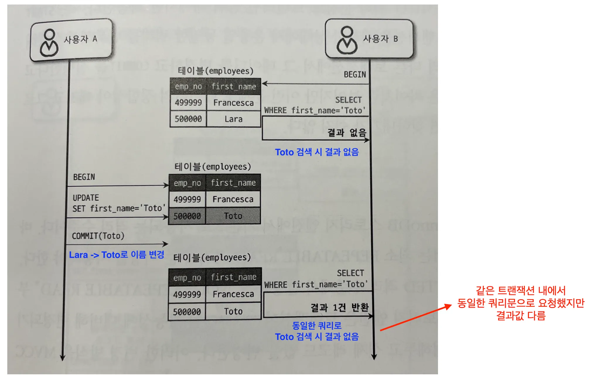
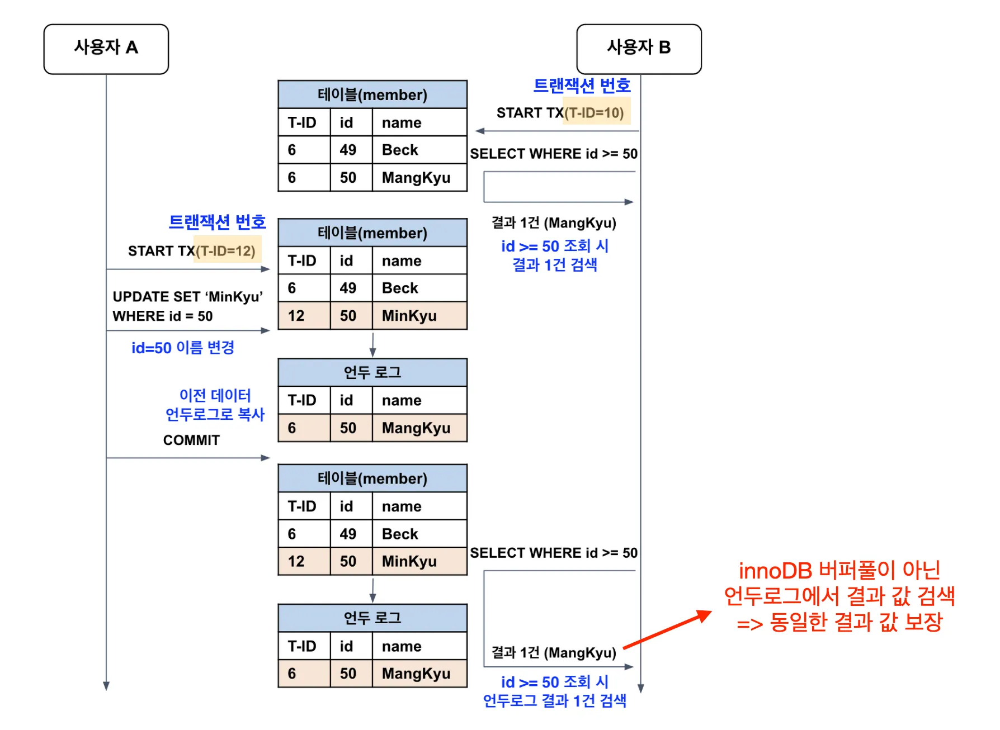
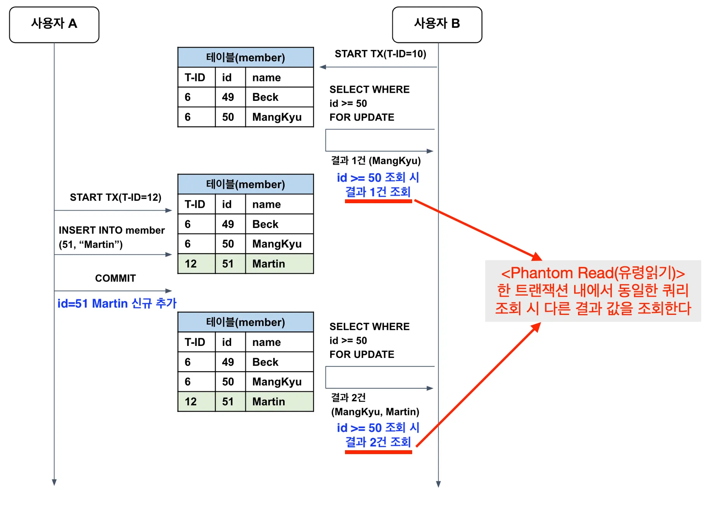

- MySQL의 격리 수준이란?
  - 특정 트랜잭션이 타 트랜잭션에서 변경 또는 조회하는 데이터를 볼 수 있도록 할지에 대한 권한 결정
- 격리 수준 4가지

  - (참고) 언두 로그
    
    <aside>
    💡 사실상 Serializable 외 격리 수준 성능 차이 없음

    </aside>

    - `Read-Uncommitted` = Dirty-read
        <aside>
        💡 Dirty-read : 트랜잭션 작업이 완료되지 않은 상태에서 다른 트랜잭션이 조회할 수 있는 현상
        
        </aside>
        
        - 거의 사용하지 않는 격리 수준
        - commit되지 않은 데이터도 조회
        - 데이터 정합성 문제가 발생한다.
            - ex) 아래 예시에서 Martin 검색 후 해당 트랜잭션에서 Martin이 있다는 가정 하에 내부 로직을 수행하지만 타 트랜잭션에서 Rollback 시 Martin은 없어짐.
                
                

    - `Read-Committed`
      - commit된 데이터만 조회
        
      - 하지만, 부정합(Non-Repeatable Read) 문제가 있음
          <aside>
          💡 Repeatable Read : 한 트랜잭션 내에서 동일한 쿼리 조회 시 `동일한` 결과 값을 반환한다.
          Non-Repeatable Read : 한 트랜잭션 내에서 동일한 쿼리 조회 시 `다른` 결과 값을 반환한다.
          
          </aside>
          
          
          
          - 금전적인 처리 작업 시, Non-Repeatable Read는 문제가 된다!
              - 오늘 입금, 출금된 총액 계산 시 쿼리를 실행할 때마다 다른 결과 값을 가져오는 경우 혼란을 야기할 수 있다
    - `Repeatable-Read`
        <aside>
        💡 Read-Committed와 Repeatable-Read의 차이 = 언두 영역의 여러 버전 중 몇 번째 이전 버전을 조회하느냐
        
        </aside>
        
        - 한 트랜잭션 내에서 `동일한 쿼리 조회 시 동일한 결과 값을 보장`한다.
        - 변경 전의 레코드는 언두 공간에 백업한다.
        - 언두 로그에 백업된 데이터는 InnoDB 엔진이 불필요하다고 판단하는 시점에 주기적으로 삭제된다.
        - 트랜잭션을 빠르게 종료하지 않으면 그 사이 언두로그에 레코드가 쌓이면서 MySQL 처리 성능 저하될 수 있다.
        
        
        
        - 하지만,  부정합(Non-Repeatable Read) 문제 있음
            
            <aside>
            💡 위 예시처럼 기존에 가지고 있는 데이터의 update에 대해서는 언두로그로 저장되지만 insert에 대해서는 언두로그 저장이 아닌 신규 레코드 추가가 되면서 Phantom Read 현상 발생
            (Phantom Read : 레코드가 보였다 안보였다 하는 현상)
            
            </aside>
            
            

    - `Serializable`
      - 가장 엄격한 격리 수준
      - 트랜잭션이 순차적으로 처리되어야하여 성능이 떨어진다.
      - 동시성이 중요한 경우 처리 성능이 떨어지다보니 사용하지 않는다.
      - Phantom Read가 전혀 발생하지 않는다.
        → InnoDB 엔진에서 갭 락, 넥스트 키 락이 있기 때문에 Repeatable-Read에서도 충분히 Phantom Read 대처가능
    - (이전 챕터 내용)데이터 읽는 위치
      - Serializable, Repeatable-Read, Read-Committed ⇒ 언두로그 데이터 반환
      - Read-Uncommitted ⇒ InnoDB 버퍼풀의 변경된 데이터 반환

    (참고 : https://mangkyu.tistory.com/299)

    <aside>
    💡 Amondz prod 격리 수준 : Read-Committed

    </aside>
