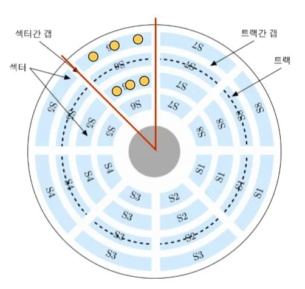
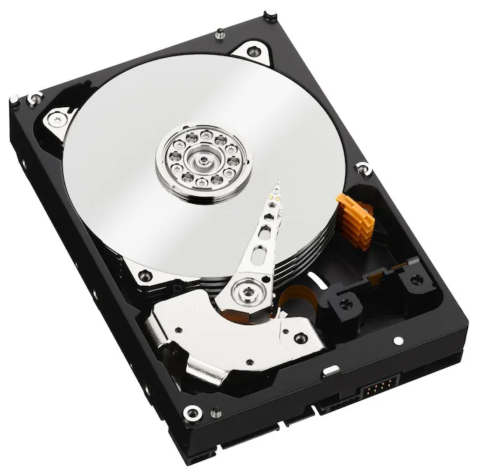
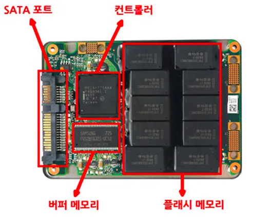
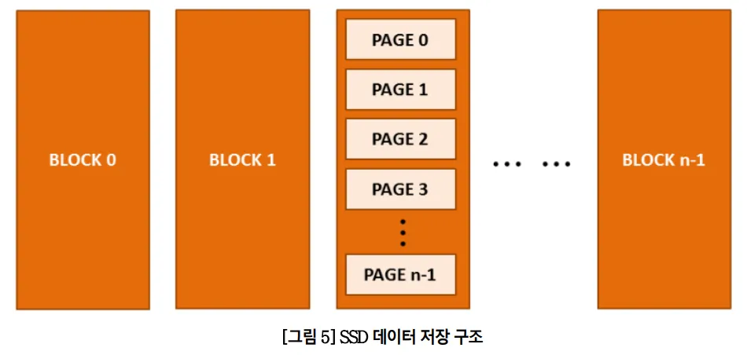

- HDD
  
  
  HDD
  - HDD의 경우 각 트랙과 섹터별 고유 주소가 생성 → 모터로 원판을 회전시켜서 특정 주소로 이동 후 읽기 및 쓰기
- SSD
  
  
  - SSD의 경우 플래시 메모리를 사용하며 블록과 페이지 주소로 이동하여 읽기 및 쓰기
  - 랜덤 I/O 효율이 HDD보다 훨씬 좋으며, DBMS의 경우 랜덤 I/O가 많아서 SSD는 DBMS에 적합
- 랜덤 I/O와 순차 I/O
  - 랜덤 I/O의 경우 원하는 위치로 이동하기 위해 디스크 헤드를 여러번 움직여야하지만 순차 I/O는 한번만 이동하면 된다. 그리고 **디스크에 데이터를 읽고 쓰는데 걸리는 시간은 디스크 헤드 이동시간이 큰 영향**을 준다.
  - 따라서 속도를 개선하기 위해 순차 I/O를 늘리던가 랜덤 I/O를 줄이는 2가지 방법이 있지만 순차 I/O를 늘리는 방법은 어렵고 결국 **랜덤 I/O를 줄이는 방법이 쿼리 튜닝의 목적**이다.
  - 랜덤 I/O가 DBMS에서 많을 수 밖에 없는 이유는 아마 인덱스로 데이터 주소에 접근하기 때문일 것 같다
- 인덱스
  - 목차 - 인덱스, 페이지 - 주소, 내용 - 데이터 파일
  - DBMS는 인덱스를 sortedList로 관리
  - sortedList의 경우 쓰기시에 정렬하는 자료구조. 쓰기시에 오래걸리지만 읽기 시에 효율이 높다
  - 인덱스는 중복 여부에 따라 `프라이머리 키`와 `세컨더리 인덱스`로 분류할 수 있다.
  - 데이터 저장 방식에 따라서는 `B-Tree 인덱스`, `Hash 인덱스`, `Fractal-Tree 인덱스`, `Merge-Tree 인덱스` 등으로 분류할 수 있다.
  - 기능 별로는 `전문 검색용 인덱스`와 `공간 검색용 인덱스`가 대표적이다.
- B-Tree 동작 원리
  [https://www.cs.usfca.edu/~galles/visualization/BTree.html](https://prod-files-secure.s3.us-west-2.amazonaws.com/0e80e23f-5026-4a62-aa57-61a3883e6784/4693c62d-ef1d-4eb0-a383-88907946545b/%E1%84%92%E1%85%AA%E1%84%86%E1%85%A7%E1%86%AB_%E1%84%80%E1%85%B5%E1%84%85%E1%85%A9%E1%86%A8_2024-01-18_%E1%84%8B%E1%85%A9%E1%84%8C%E1%85%A5%E1%86%AB_9.36.13.mov)
  https://www.cs.usfca.edu/~galles/visualization/BTree.html
