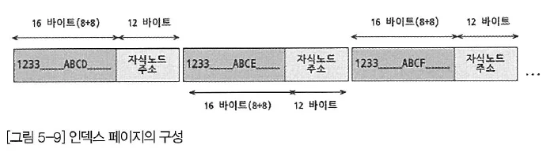
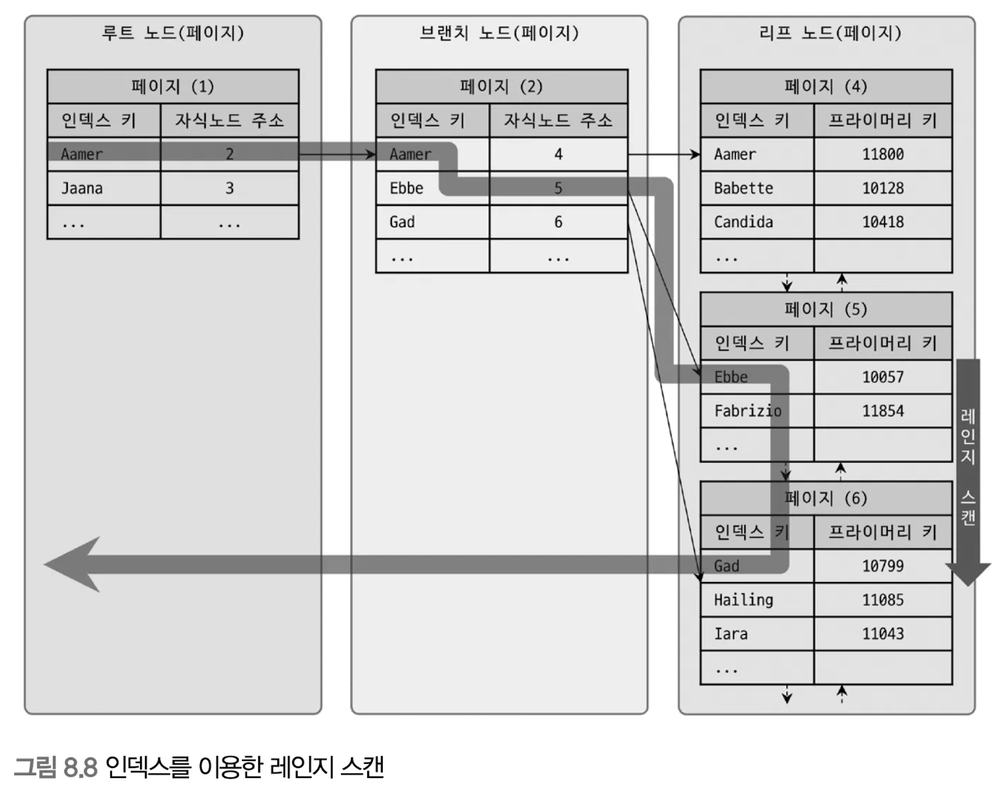
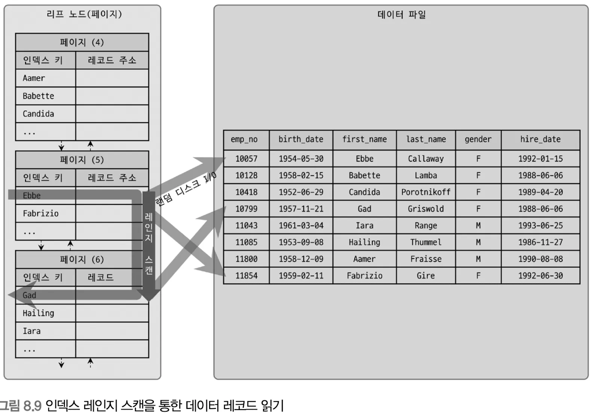
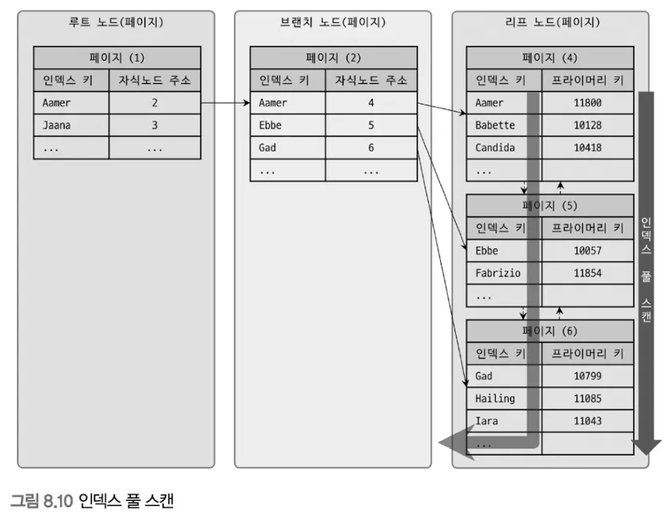
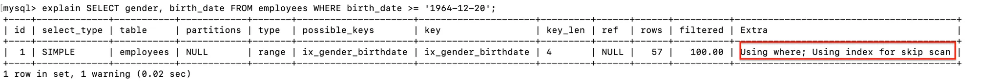
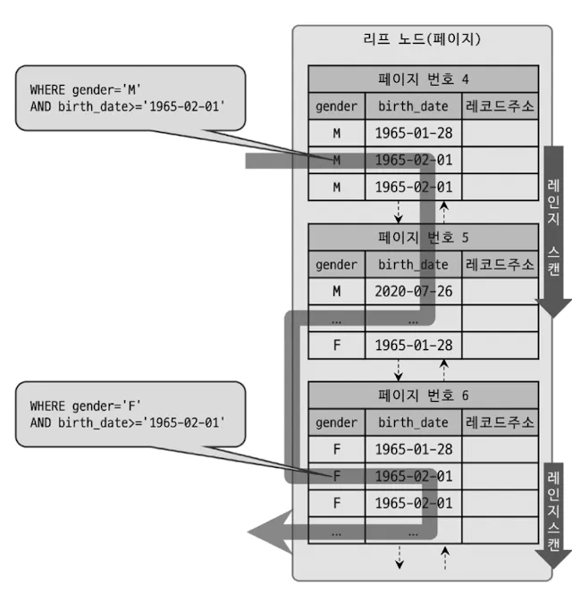
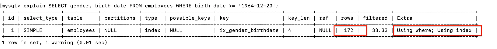
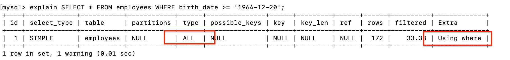

- **B-Tree 인덱스 사용에 미치는 요소**
  - 인덱스 키
    - 디스크에 데이터를 저장하는 가장 기본 단위는 페이지(Page = Block)
      - 디스크 읽기 및 쓰기 작업의 최소 단위
      - InnoDB 스토리지 엔진 버퍼 풀에서 데이터 버퍼링의 기본 단위
      - 인덱스가 관리되는 단위(루프 / 브랜치 / 리프) 즉, 노드 = 페이지
    - 인덱스 페이지 구성
      
    - 키 구성
      - 키값
        - 인덱스가 생성될 때 지정된 테이블의 하나 이상의 컬럼으로부터 추출된 값
      - 자식 노드 주소
        - 실제 테이블의 행을 가리키는 포인터
      - **키 값의 크기**
        - 컬럼의 데이터 유형
          - ex. 정수형 데이터는 문자열 데이터보다 일반적으로 크기가 작음
        - 키로 사용되는 컬럼의 정의된 길이
          - ex. VARCHAR(255)는 VARCHAR(100)보다 더 큰 키 크기를 가질 수 있음
        - 복합 인덱스
          - 여러 컬럼이 하나의 키로 결합되며, 키 크기는 모든 컬럼의 데이터 유형과 길이를 합한 것
      - **키 값 최소화**
        - 데이터 유형 최적화
          - 데이터 성질에 따라 가능한 작은 데이터 유형과 크기를 설정
        - 필요한 컬럼만 인덱싱하여 복합 인덱스에 대한 크기를 줄이기
        - 정규화
          - 긴 문자열 대신 해당 문자열을 참조하는 작은 크기의 정수 ID를 인덱스화 …
    - 인덱스 키 값이 늘어날 경우
      - 키의 크기가 크면 페이지에 저장할 수 있는 키의 개수가 줄어든다 → DB에 접근해 읽어야 하는 횟수가 늘어남 → 성능 저하
        - ex.
          - 페이지 기본값(16KB)
          - 키: 16바이트, 자식 노드 주소: 12바이트
          - 페이지 저장 가능 인덱스 수: 16 \* 1024 / (16+12) = 585
      - 인덱스를 캐시해두는 InnoDB 버퍼 풀 영역에 캐시해둘 수 있는 인덱스 수가 줄어듬 → 메모리 효율 저하
      - 하나의 인덱스 페이지가 담을 수 있는 개수가 적어짐 → `B-Tree` 깊이가 깊어짐 → 디스크 I/O가 더 많아짐
        - 인덱스 키 값과 관계
          - ex. 기존 예시와 동일한 조건에서 깊이가 3
            - 최대 가질 수 있는 키 값 개수: (585 _ 585 _ 585)
          - ex. 키값 2배로 늘어남
            - 페이지 저장 가능 인덱스 수: 16 \* 1024 / (32+12) = 372
            - 최대 가질 수 있는 키 값 개수: (372 _ 372 _ 372)
  - B-Tree 깊이
    - MySQL에서 값을 검색할 때 몇번이나 랜덤하게 디스크를 읽어야하는지와 직결
    - 인덱스 키 값은 작을수록 좋다
    - 데이터를 찾기 위해 이동해야 하는 노드 수 → 노드마다 깊이가 1
      - 루트 → 브랜치 : 1
      - 브랜치 → 리프 : 1(리프 → 데이터파일)
  - 선택도(가수성)
    - 모든 인덱스 키 값 가운데 유니크한 값의 수
    - 인덱스로 선정된 컬럼에 중복된 값이 많아질수록 선택도 값은 감소
    - 선택도가 낮은 컬럼에는 인덱스를 걸지 않는 것이 좋다
      ```tsx
      // 총 10,000개 데이터
      mysql> SELECT *
      		FROM tb_test
              WHERE country='KOREA' AND city='SEOUL'
      ```
      1. country 유니크한 값 10개
         - 인덱스를 통해 `1000` 건(10000 / 10) read
         - `1000`건 중 실제 데이터 1개 → 999건의 불필요한 데이터 read
      2. country 유니크한 값 1,000개
         - 인덱스를 통해 `10` 건(10000 / 1000) read
         - `10`건 중 실제 데이터 1개 → 9건의 불필요한 데이터 read
  - 읽어야하는 레코드 건수
    - 테이블에서 직접 1건을 읽는 것보다 인덱스를 통해 읽는 것이 `4-5`배 정도 더 비용이 많이 듦
      - 인덱스 통해 읽을때 전체 테이블 레코드의 `20-25%` 를 넘어서면 비효율
        (인덱스를 사용하도록 해도 옵티마이저에서 알아서 테이블을 직접 읽는 방식으로 처리)
- **B-Tree 인덱스를 통한 데이터 읽기**

  - 인덱스 레인지 스캔
    - 검색해야 할 `Between` 과 같이 **인덱스 범위가 결정되었을 때** 사용하는 방식
    - **동작 과정**
      - 탐색이 필요한 레코드의 **시작 지점**을 찾는다
        - 루트 노드부터 비교를 시작해, 리프 노드까지 찾아 들어가는 과정
      - 리프 노드에 도달하면 해당 시작 위치부터 필요한 만큼 순서대로 레코드를 읽는다
      - 스캔하다가 페이지의 마지막에 다다르면, **리프 노드 간의 링크**를 이용해 다음 리프 노드를 찾아서 다시 스캔
      - 쿼리가 필요한 데이터가 모두 인덱스만으로 찾을 수 있는 경우(`covering index`)가 아니면,
        **레코드 주소를 기반으로 실제 데이터 파일에 접근** - 실제 데이터 파일 레코드 당 한 건 단위로 **랜덤 `I/O`** 발생
        
        
        **⇒ 인덱스를 통해 데이터 레코드를 읽는 작업은, 비용이 많이 든다**
    - 인덱스를 얼마나 탔는지 확인하는 방법
      ```sql
      SHOW STATUS LIKE 'Handler_%';
      ```
      - `Handler_read_key` : 인덱스에서 조건을 만족하는 값이 저장된 위치를 찾는 과정(인덱스 탐색)이 실행된 횟수
      - `Handler_read_next` : 탐색 위치부터 필요한 만큼 인덱스를 읽은 레코드 건수(인덱스 스캔)
  - **인덱스 풀 스캔**
    - 처음부터 끝까지 모두 읽는 방식
    - vs 테이블 풀 스캔
      1. 인덱스 크기는 테이블 크기보다 작으므로 적은 디스크 I/O로 쿼리를 처리
      2. 인덱스에 포함된 컬럼만(`covering index`)으로 쿼리를 처리할 수 있다면 테이블의 레코드를 읽을 필요가 없어 랜덤 I/O를 방지
         (select, where 다 인덱스 컬럼만)
    - **쿼리의 조건절에 사용된 컬럼이 인덱스 첫 번째 컬럼이 아닌 경우** 사용
    - ex. 인덱스가 (A, B, C) 순서로 만들어져 있을 때 쿼리 조건절을 B 혹은 C 칼럼으로 검색하는 경우
      
      **⇒ 인덱스 풀 스캔 방식은 인덱스를 효율적으로 사용하지 못하는 방식**
  - **루스 인덱스 스캔**

    - **인덱스의 일부만을 스캔하여 필요한 데이터를 찾는 방법**
    - 오라클 DBMS의 "인덱스 스킨 스캡" 과 작동 방식이 비슷
    - 루스 인덱스 스캔은, 느슨하게 듬성듬성 인덱스를 읽는 방식으로 처리
    - 일반적으로, `GROUP BY` 혹은 집합 함수 가운데 `Min`, `Max` 함수에 대해 최적화를 하는 경우에 사용

      ```sql
      mysql > SELECT dept_no, MIN(emp_no)
      		FROM dept_emp
              WHERE dep_no BETWEEN 'd002' AND 'd004'
              GROUPY BY dept_no;

      SELECT DISTINCT column1 FROM table WHERE column2 = 'value'; // column1 인덱스 설정 시 중복 무시
      ```

      - 인덱스는 (dept_no, emp_no) 순으로 정렬
      - dept_no 별로 첫 번째 레코드의 emp_no 값만 읽음
        그 외의 값은 알아서 무시 → 옵티마이저가 판단하여 조건에 만족하지 않는 레코드는 무시

  - **인덱스 스킵 스캔**

    - **복합 인덱스에서 첫 번째 컬럼을 조건으로 사용하지 않는 쿼리에 사용**
    - 복합 인덱스에서, 일반적으로 첫번째에 있는 컬럼에 대한 비교 조건이 없는 경우는 인덱스를 타지 못함
    - ex. `(gender, birth_date)` 순으로 인덱스를 생성
      - 인덱스 x
        ```sql
        SELECT gender, birth_date
        FROM employees
        WHERE birth_date >= '1964-12-20';  // 인덱스를 타지 못함
        ```
      - 인덱스 o
        ```sql
        SELECT gender, birth_date
        FROM employees
        WHERE gender='M' AND birth_date >= '1964-12-20';  // 인덱스를 탐
        ```
    - ! **인덱스 구성 컬럼의 순서**는 매우 중요
    - **`MySQL 8.0` 버전부터는, 옵티마이저가 `gender` 칼럼을 건너뒤어서 `birth_date` 칼럼만으로 인덱스 검색이 가능하게 해주는 인덱스 스킵 스캔(Index Skip Scan) 최적화 기능이 도입**

      - **skip-scan 활성화**

        ```sql
        SET optimizer_switch='skip_scan=on';  // skip-scan 활성화

        EXPLAIN
        SELECT gender, birth_date
        FROM employees
        WHERE birth_date >= '1964-12-20';
        ```

        

        - `type=range` 는 필요한 부분만 읽었다는 것을 의미하며, `57` 개의 데이터만 스킵 스캔으로 가져옴 → how?
          1. 루스 인덱스 스캔 방식으로 맨 첫번째 인덱스에 칼럼에 대해 모든 값을 추출(중복제외)
          2. 추출한 값에 대해 인덱스 스킵 스캔을 실행
        - ex. `Gender` 'M' | 'F'

          ```sql
          SELECT gender, birth_date FROM employees
          WHERE Gender='M' and birth_date >= '1964-12-20';

          SELECT gender, birth_date FROM employees
          WHERE Gender='F' and birth_date >= '1964-12-20';
          ```

          

      - **skip-scan 비활성화**
        ```sql
        SET optimizer_switch='skip_scan=off';  // skip-scan 활성화
        ```
        
        - `type` 값 `index` 이므로 인덱스 풀 스캔
        - `172`개의 모든 데이터를 읽음
        - `SELECt *` 로 테이블 모든 데이터를 가져와야 했다면 테이블 풀 스캔
      - 인덱스 스킵 스캔은, 아래 두 가지를 지켜야만 실행됨

        1. WHERE 조건절에, 조건이 없는 인덱스 선행 칼럼의 선택도가 작아야함
        2. SELECT 대상이 인덱스에 존재하는 컬럼만으로 처리 가능한 경우(커버링 인덱스)

           

  - 복합인덱스 사용 케이스
    - **다중 컬럼 필터링**
      - **`SELECT * FROM orders WHERE customer_id = 1 AND status = 'shipped'`**와 같은 쿼리에서 **`customer_id`**와 **`status`** 컬럼에 대한 복합 인덱스
    - **정렬과 필터링의 조합**
      - **`SELECT * FROM users WHERE age > 30 ORDER BY last_name`** 쿼리에는 **`age`**와 **`last_name`**에 대한 복합 인덱스
  - 단일인덱스 사용 케이스
    - **단일 컬럼 필터링**
      - **`SELECT * FROM products WHERE category = 'electronics'`** 쿼리에서 **`category`** 컬럼에 대한 단일 인덱스
    - **빈번한 조회**
      - 특정 컬럼이 빈번하게 조회되는 경우
    - **정렬 최적화**
      - 특정 컬럼을 기준으로 자주 데이터를 정렬
