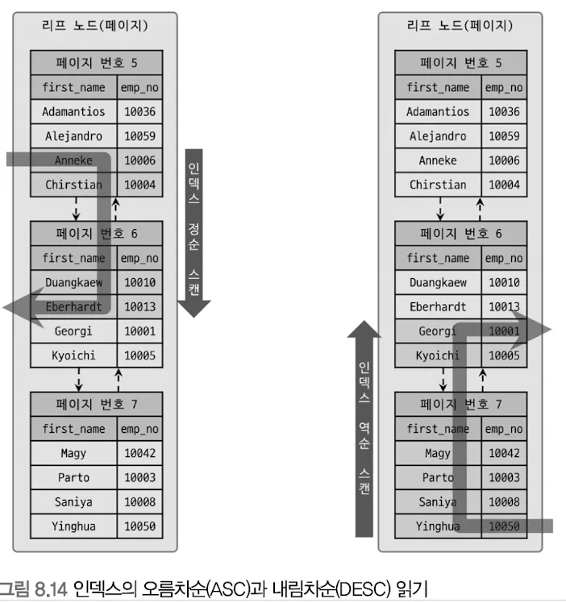
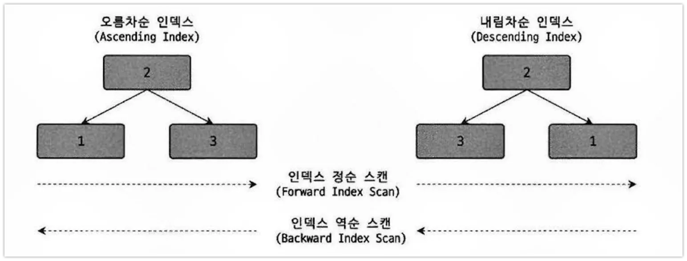
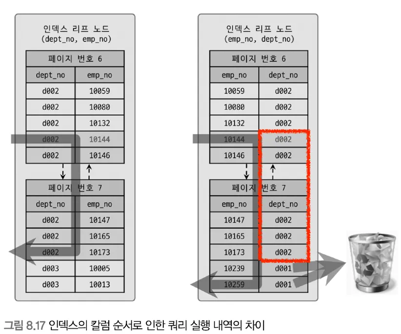
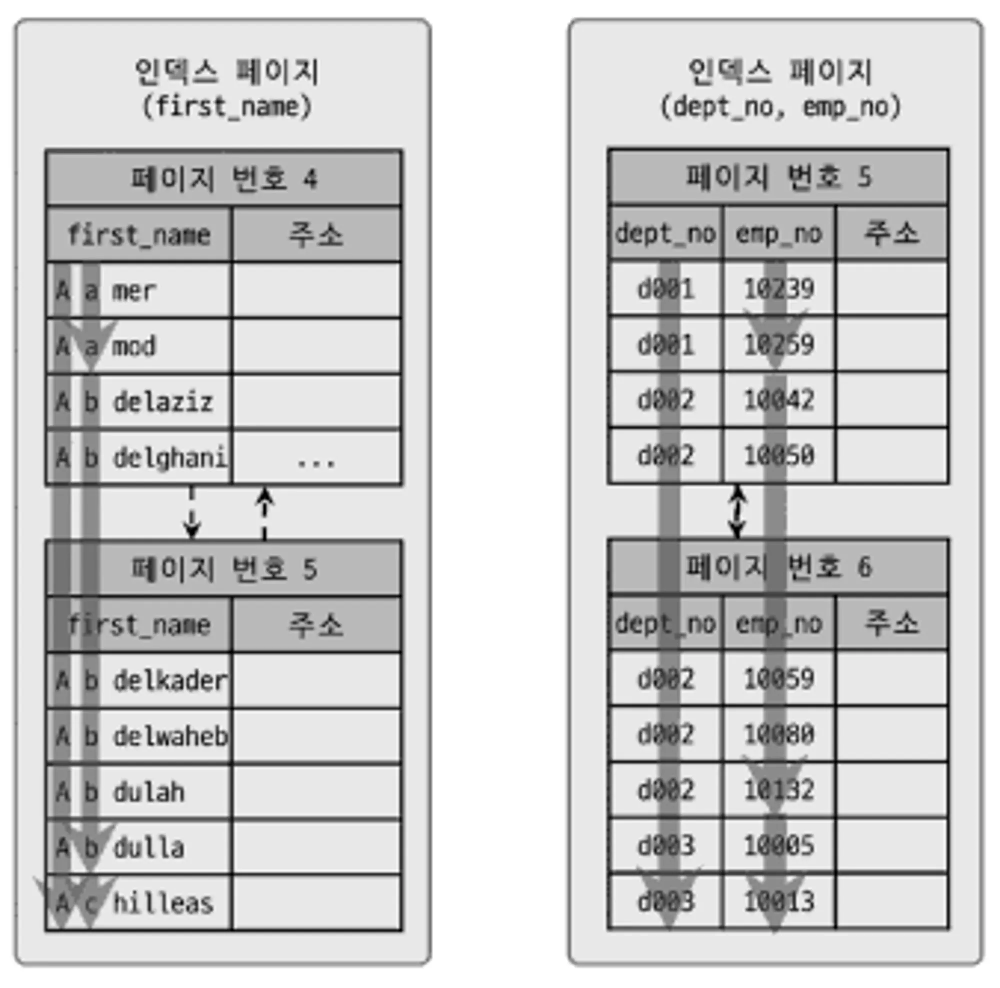

- 오름차순, 내림차순으로 정렬하더라도 스캔을 어떤 방향으로 하냐에 따라 거꾸로 읽을 수도 있다.
- 다중 칼럼 인덱스
  - 두 개 이상의 칼럼으로 구성된 인덱스
  - 각 칼럼의 순서(위치)가 중요
- B-Tree 인덱스 정렬 및 스캔 방향

  - 인덱스 스캔 방향은 정렬 쿼리에 따른 `옵티마이저가 만들어내는 실행계획에 따라 결정`된다.

  ### 인덱스의 정렬

  - MySQL 8.0부터 인덱스 생성 시 정렬 순서 혼합 가능
  - MySQL 5.7에서도 아래와 같이 쿼리문 작성 시 오류는 나지 않지만 실제로는 데이터가 오름차순으로만 정렬됐음
    ```tsx
    CREATE INDEX ix_teamname_userscore ON employees (team_name ASC, user_score DESC);
    ```

  ### 인덱스 스캔 방향

  

  - 쿼리가 인덱스를 사용하는 시점에 인덱스를 읽는 방향에 따라 오름차순, 내림차순 정렬 효과를 얻을 수 있음
    ```tsx
    SELECT * FROM employees ORDER BY first_name ASC LIMIT 5;    // 정순으로 읽기
    SELECT * FROM employees ORDER BY first_name DESC LIMIT 5;   // 역순으로 읽기
    ```

  ### 내림차순 인덱스

  

  - 오름차순 인덱스 : 작은 값의 인덱스 키가 B-Tree의 왼쪽으로 정렬
  - 내림차순 인덱스 : 큰 값의 인덱스 키가 B-Tree의 왼쪽으로 정렬
  - 인덱스 정순 스캔 : 리프 노드의 왼쪽 → 오른쪽 스캔
  - 인덱스 역순 스캔 : 리프 노드의 오른쪽 → 왼쪽 스캔
  - 정순/역순 스캔 차이

    - 소요 시간 : 정순 < 역순 (28.9% 더)
    - InnoDB에서 역순 스캔이 느린 이유

      - 페이지 잠금이 인덱스 정순 스캔에 적합한 구조
      - 페이지 내에서 인덱스 레코드가 단방향으로 연결된 구조
        <aside>
        💡 InnoDB 페이지는 Heap 처럼 사용되기 때문에 물리적으로 순서대로 저장되어 있지 않다.

        </aside>

        ```tsx
        // 오른차순 정렬에서 맨 마지막 데이터 가져오기
        // 평균 : 940ms
        SELECT *
        FROM OrderItem oi
        ORDER BY oi.id ASC
        LIMIT -,1;

        // 내림차순 정렬에서 맨 마지막 데이터 가져오기
        // 평균 : 1s 30ms (1초 이상 걸림)
        SELECT *
        FROM OrderItem oi
        ORDER BY oi.id DESC
        LIMIT -,1;
        ```

        - but, 역순이 필요할 상황에서 많은 데이터를 자주 조회할 경우에는 오름차순보다는 내림차순이 효율적이다.

- B-Tree 인덱스의 가용성과 효율성

  ### 비교 조건의 효율성

  

  ```tsx
  // 다중 칼럼 인덱스
  SELECT *
  FROM Review r
  WHERE r.productId = - AND r.rate > 3;
  ```

  - CASE A : `r.productId = - AND r.rate > 3`
    - productId가 77719이고 rate가 3을 초과한 레코드를 1개를 먼저 찾고 그 이후로 productId가 77719가 아닐 때까지 찾으면 됨
    - 두번째 조건 rate가 비교 작업의 범위를 좁히는 데 도움 O ⇒ 작업 범위 결정 조건
  - CASE B : `r.rate > 3 AND r.productId = -`

    - rate가 3을 초과한 레코드를 모두 찾은 후 productId가 77719인지 모두 비교
    - 두 번째 조건 rate가 비교 작업의 범위를 좁히는데 도움 X. 조건이 맞는지 검사 용도로만 사용됨 ⇒ 필터링 조건 or 체크 조건
    <aside>
    💡 작업 범위 결정 조건은 많으면 많을 수록 쿼리 처리 성능 높임
    체크 조건을 통해 최종적인 레코드의 양은 적을 수 있지만 성능을 높이지 못함

    </aside>

    ### 인덱스의 가용성

    

    - B-Tree 인덱스는 왼쪽 값을 기준으로 오른쪽 값이 정렬되어있기 때문에 왼쪽 값을 모르면 인덱스 레인지 스캔을 할 수 없다.
    - CASE A
      ```tsx
      SELECT * FROM employees WHERE first_name LIKE '%mer';
      ```
      - first_name을 비교해야하는데 LIKE 조건문에서 왼쪽 값이 고정되어있지 않음. ⇒ 인덱스 레인지 스캔 불가
    - CASE B
      ```tsx
      SELECT * FROM dept_emp WHERE emp_no >= -;
      ```
      - 다중인덱싱(dept_no, emp_no)으로 구성된 인덱스
      - 선행 칼럼인 dept_no 없이는 인덱스 효율적 사용 불가

    ### 인덱스 사용 불가 비교 조건(작업 범위 결정 조건 X)

    ```sql
    // NOT-EQUAL
    WHERE column <> 'N'
    WHERE column NOT IN(a, b)
    WHERE column IS NOT NULL

    // LIKE 조건에서 왼쪽 값이 고정이 아닐 경우
    // 반대로 왼쪽값이 고정일 경우에는 작업 범위 결정 조건에 해당됨(비교 연산자와 동급)
    WHERE column LIKE '%혜'
    WHERE column LIKE '_혜'
    WHERE column LIKE '%혜%'

    // 인덱스 칼럼이 변형된 후 비교
    WHERE SUBSTRING(column, 1, 1) = 'X'
    WHERE DAYOFMONTH(column) = 1

    // NON-DETERMINISTIC 속성의 스토어드 함수가 비교 조건에 사용
    WHERE column = deterministic_function()

    // 데이터 타입이 서로 다른 비교
    WHERE char_column = 10

    // 문자열 데이터 타입의 콜레이션이 다른 경우
    WHERE utf8_bin_char_column = euckr_bin_char_column
    ```

    <aside>
    💡 WHERE column IS NULL은 작업 범위 결정 조건에 해당

    </aside>

    ### ⭐️효율적으로 인덱스 사용하기⭐️

    - 작업 범위 결정 조건으로 인덱스 사용할 경우
      - i는 2이상 총 칼럼 길이 n보다 작은 임의의 값
      - column1 ~ column(i-1) 까지 동등 비교 형태로 `=`이나 `In()` 사용
      - column(i)는 다음 연산자 중 하나로 비교
        - 동등 비교 : `=` or `In()`
        - 비교 연산 : `>` or `<`
        - LIKE 좌측일치 패턴 : `LIKE ‘조%’`
    - 작업 범위 결정 조건으로 인덱스 사용 못하는 경우
      - column1에 대한 조건 없음
      - column1 비교조건이 인덱스 사용 불가 조건 중 하나

    ```sql
    // 인덱스 사용 불가 케이스
    WHERE column1 <> 2
    WHERE column1 LIKE '%혜'   // 왼쪽이 고정되어있지 않은 LIKE 조건문
    ```

    ```sql
    // 인덱스 사용 가능 케이스(작업 범위 결정 조건)

    // column1, column2 작업 범위 결정 조건
    WHERE column1 = 1 AND column2 > 10

    // column1, column2, column3 작업 범위 결정 조건
    WHERE column1 IN(1, 2) AND column2 = 2 AND column3 <= 10

    // column1, column2, column3 작업 범위 결정 조건. column4 체크조건
    WHERE column1 = 1 AND column2 = 2 AND column3 IN(1, 2) AND column4 <> 100

    // column1, column2, column3, column4 작업 범위 결정 조건
    WHERE column1 = 1 AND column2 = 2 AND column3 = 3 AND column4 LIKE '조혜%'     // 왼쪽이 고정되어있는 LIKE 조건문

    // column1, column2, column3, column4, column5 작업 범위 결정 조건
    WHERE column1 IN(1, 2) AND column2 = 2 AND column3 = '조혜' AND column4 = '비주얼' AND column5 > 5
    ```
