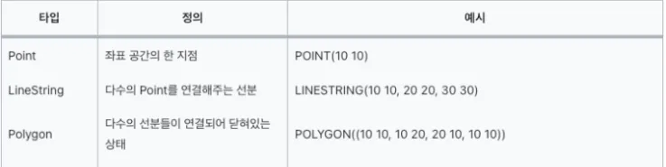
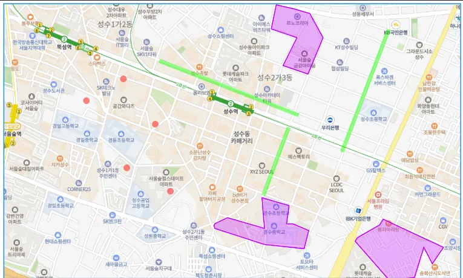
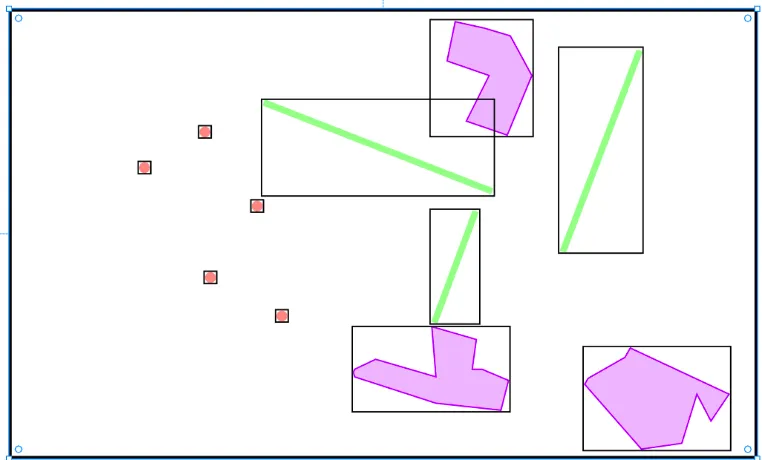
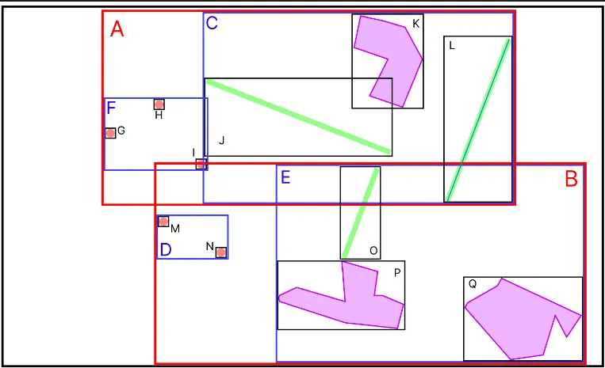
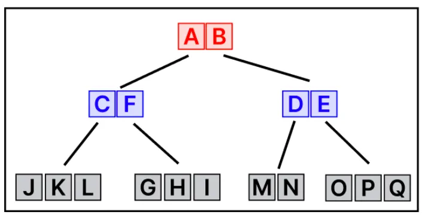
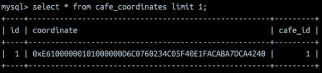

- MBR(Minimum Bounding Rectangle)
  참고 https://kong-dev.tistory.com/245
  
  
  
  
  

  ```jsx
  CREATE TABLE cafe_coordinates
  (
      id         BIGINT NOT NULL AUTO_INCREMENT,
      coordinate POINT  NOT NULL,
      cafe_id    BIGINT NOT NULL,
      PRIMARY KEY (id),
      FOREIGN KEY (cafe_id) REFERENCES cafe (id)
  );

  CREATE SPATIAL INDEX idx_coordinates ON cafe_coordinates (coordinate);
  ```

  ```jsx
  INSERT INTO cafe_coordinates (coordinate, cafe_id) VALUES (ST_PointFromText('POINT(10 20)', 4326), 1);
  ```

  > 여기서 4236은 좌표 시스템 종류중 하나로 WGS84(GPS)를 의미
  > 

  ```jsx
  SELECT * FROM tb_location WHERE ST_Contains(상자,co.coordinate)
  ```
