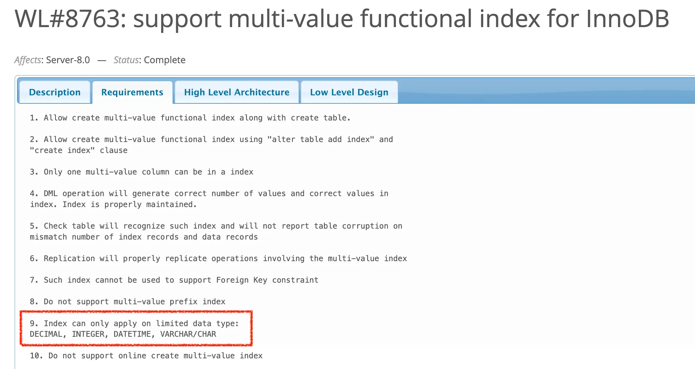
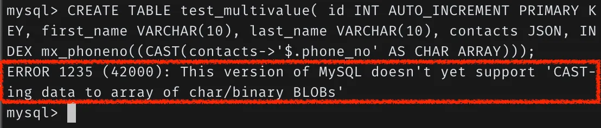

- 함수 기반 인덱스

  - MySQL 8.0부터 함수 기반 인덱스 지원
  - B-Tree 인덱스와 인덱싱할 값을 계산하는 방법만 다르지 구조 및 유지관리 방법은 동일
  - 함수 기반 인덱스 구현법

    - 가상 칼럼을 이용한 인덱스
    - 함수를 이용한 인덱스
      <aside>
      💡 둘 다 내부적인 구현 방법은 동일하다

      </aside>

  ### 가상 칼럼을 이용한 인덱스

  - 테이블에 새로운 칼럼을 추가하는 것과 같은 효과를 내기 때문에 실제 테이블 구조가 변경된다는 단점

  ```sql
  // 테이블 생성
  CREATE TABLE user(
  	id INT,
  	first_name VARCHAR(10),
  	last_name VARCHAR(10),
  	PRIMARY_KEY (id)
  );

  // full_name 가상 칼럼 추가
  ALTER TABLE user
  	ADD full_name VARCHAR(30) AS (CONCAT(first_name, ' ', last_name)) VIRTUAL,  // 가상 칼럼 추가
  	ADD INDEX ix_fullname (full_name);  // 가상 칼럼 인덱스 생성

  // 가상 컬럼 인덱스를 이용한 검색
  SELECT * FROM user WHERE full_name='Hyein Cho'; => explain 시 ix_fullname 인덱스를 타게됨
  ```

  - VIRTUAL, STORED 옵션
      <aside>
      💡 15.8 절에서 자세하게 다룬다고 하여 여기서는 간단하게 차이점만 짚고 넘어갑니다
      
      </aside>
      
      - VIRTUAL : 실제로 칼럼 값이 저장되지는 않음 → 공간 차지 X
      - STORED : 실제로 칼럼 값이 저장됨 → 공간 차지 O

  ### 함수를 이용한 인덱스

  - MySQL 8.0부터 테이블 구조 변경 없이 직접 인덱스 생성 가능 → 공간 차지할까요?
    ```sql
    // 테이블 생성
    CREATE TABLE user(
    	id INT,
    	first_name VARCHAR(10),
    	last_name VARCHAR(10),
    	PRIMARY_KEY (id),
    	INDEX ix_fullname (CONCAT(first_name, ' ', last_name))  // 가상 칼럼 추가 및 인덱스 생성
    );
    ```
  - 반드시 조건 절에 함수 기반 인덱스 표현식을 사용해야함. 표현식이 다르면 옵티마이저가 다른 표현식으로 간주
    ```sql
    SELECT * FROM user WHERE CONCAT(first_name, ' ', last_name) = 'HyeinCho';
    ```
      <aside>
      💡 조건문에 표현식을 반드시 동일하게 써줘야지만 사용 가능하다는 것이 편리하지는 않아보임
      
      </aside>

- 멀티 밸류 인덱스

  - 하나의 레코드가 여러 개의 키 값을 가질 수 있음
  - MySQL 8.0부터 JSON 데이터 타입을 지원하여 인덱스 요건 발생

    ```sql
    // 테이블 생성
    CREATE TABLE user(
    	id INT,
    	first_name VARCHAR(10),
    	last_name VARCHAR(10),
    	credit_info JSON,
    	INDEX mx_creditscores ((CAST(credit_info -> '$.credit_scores' AS UNSIGNED ARRAY)))
    );

    // 데이터 추가
    INSERT INTO user VALUES(1, 'Annie', 'Cho', '{"credit_scores": [360, 353, 351]}');
    ```

  - 데이터 검색을 위해서는 지정된 함수를 이용해야 옵티마이저가 실행 계획을 세울 수 있음
    - MEMBER OF()
    - JSON_CONTAINS()
    - JSON_OVERLAPS()
      ```sql
      // 데이터 검색 -> mx_creditscores로 인덱싱을 타게됨
      SELECT * FROM user WHERE 360 MEMBER OF(credit_info -> '$.credit_scores');
      ```
  - MySQL 8.0에서는 DECIMAL, INTEGER, DATETIME, VARCHAR/CHAR 타입 모두 멀티 밸류 인덱스를 지원한다고 명시되어있으나 MySQL 8.0.31 버전까지도 지원되지 않고 있음
    → 아직 MySQL 8.3으로 업그레이드를 안했는데,, 조만간 업그레이드 후 테스트 해보도록 하겠습니닷
    → 하지만 쓰일 일이 많지 않을 듯..
    
    
