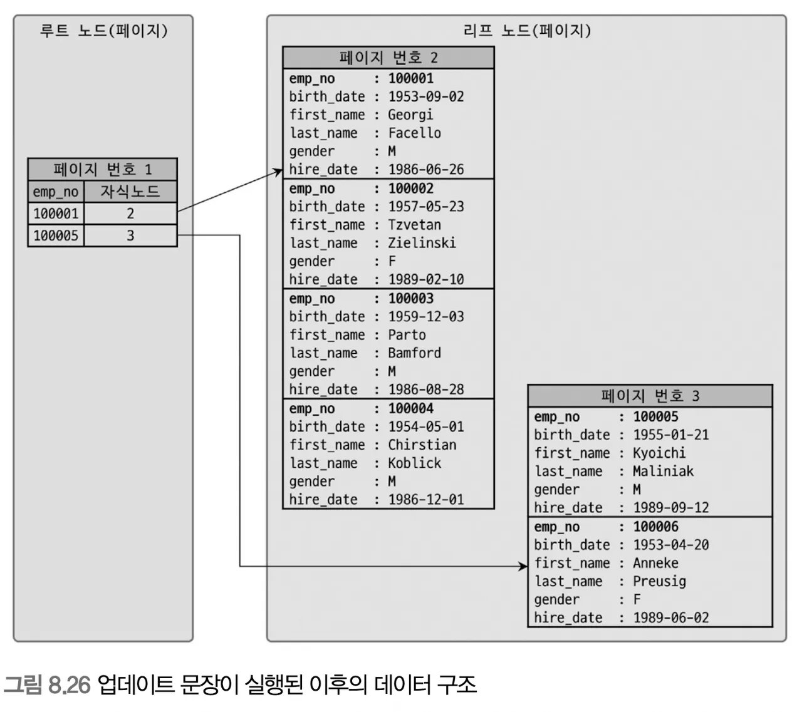
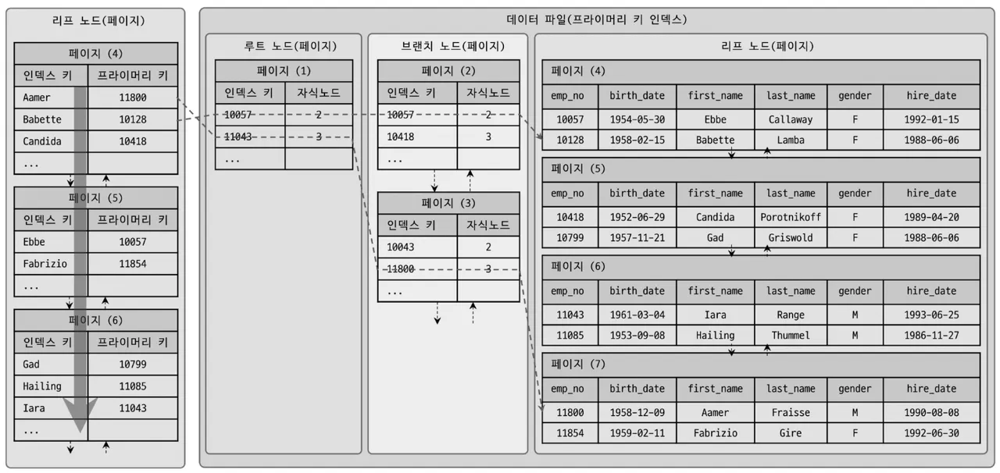
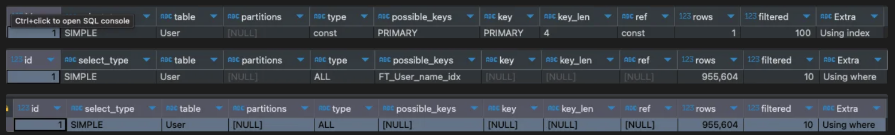

- 클러스터링인덱스
  8.8 클러스터링 인덱스

  - 여러개를 하나로 묶는다.
  - 프라이머리 키를 기준으로 묶어서 저장하는 형태
  - 비슷한 값들을 동시에 조회하는 경우가 많다는 점에서 착안

    8.8.1 클러스터링 인덱스
    

  - 프라이머리 키값에 의해 레코드 저장 위치가 결정됨
  - 프라이머리 키값이 변경되면 물리적인 위치가 바뀌어야 함
  - 테이블 레코드 저장방식이라고 볼 수 있음
  - InnoDB는 항상 클러스터링 인덱스로 저장되고 검색이 매우 빠른대신 레코드 저장이나 프라이머리 키 변경은 상대적으로 느림
  - 리프노드에 레코드의 모든 칼럼이 같이 저장돼 있다.
  - InnoDB 스토리지 엔진의 클러스터링 테이블 구성방법
    - 프라이머리 키가 있으면 프라이머리키를 클러스터링 키로 선택
    - NOT NULL 옵션의 유니크 인덱스 중 첫번째 인덱스를 클러스터링 키로 선택
    - 자동으로 유니크한 값을 가지도록 증가하는 칼럼을 내부적으로 추가한 후 클러스터링 키로 선택
  - InnoDB테이블에선 테이블당 단 하나만 가질 수 있는 혜택이므로 프라이머리 키를 명시적으로 생성하는 것을 추천
  - 클러스터링인덱스 vs 넌클러스터링(세컨더리) 인덱스
    
    - 흔히 말하는 인덱스는 넌클러스터링 인덱스와 세컨더리 인덱스는 같은 의미로 이용되는듯
    - 세컨더리 인덱스는 물리적으로 테이블을 정렬하지 않는다
    - 인덱스 페이지와 데이터 페이지(힙영역)이 분리
    - 정렬된 별도의 인덱스 페이지를 생성하고 관리
    - 테이블당 여러개 생성이 가능.
    - ## 클러스터링 인덱스에 비해 검색은 느리지 레코드 변경시 인덱스의 부하가 적다
      
  - 커버링 인덱스란 - 쿼리를 충족시키는데 필요한 모든 데이터를 갖고 있는 인덱스

        ```jsx
        SELECT * FROM user WHERE name = '준';
        SELECT name FROM user WHERE name = '엽';
        ```

    8.8.2 세컨더리 인덱스에 미치는 영향

  - InnoDB의 모든 세컨더리 인덱스는 프라이머리 키 값을 저장하도록 구현돼 있음
  - MyISAM vs InnoDB 비교(프라이머리키로 클러스터링 된 InnoDB 안 된 MyISAM) - MyISAM: 특정 인덱스를 검색해서 레코드의 주소를 확인하고 해당 주소로 최종 레코드를 가져옴 - InnoDB: 특정 인덱스를 검색해서 프라이머리 키 값을 확인하고 해당 프라이머리 키 인덱스를 검색해서 최종 레코드를 가져옴 - InnoDB가 더 복잡해 보이지만 더 큰 장점을 제공한다

    8.8.3 클러스터링 인덱스의 장점과 단점

  - 장점
    - 프라이머리 키 조회 시 처리 성능 빠름
    - 테이블의 모든 세컨더리 인덱스가 프라이머리 키를 가지고 있기 때문에 인덱스만으로 처리되는 경우가 많다
  - 단점
    - 모든 세컨더리 인덱스가 클러스터링 키를 갖기에 키 값이 크면 전체적으로 인덱스의 크기가 커진다
    - 세컨더리 인덱스를 통해 검색할 때 프라이머리 키로 한 번 더 검색해야해서 성능이 느리다.
    - Insert할 때 프라이머리 키에 의해 레코드 저장위치가 결정되어 성능이 느리다
  - 빠른읽기 & 느린쓰기

    8.8.4 주의사항

    8.8.4.1 클러스터링 인덱스 키의 크기

    8.8.4.2 프라이머리 키는 AUTO-INCREMENT 보다는 업무적인 칼럼으로 생성
    칼럼의 크기가 크더라도 해당 레코드를 대표할 수 있다면 그 칼럼을 프라이머리 키로 설정하는 것이 좋다
    8.8.4.3 프라이머리 키는 반드시 명시할 것

  - 프라이머리 키가 없는 테이블은 자동 생성하고 이는 사용자에게 보이지않기에 굳이 안만들 이유가 없다

    8.8.4.4 AUTO-INCREMENT 칼럼을 인조 식별자로 사용할 경우

  - 프라이머리 키가 길고 세컨더리 인덱스도 필요하면 인조 식별자 AUTO-INCREMENT 로 설정
