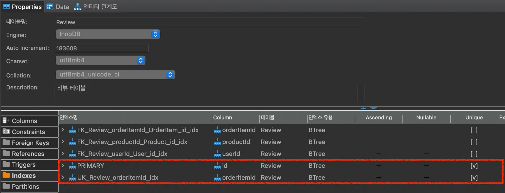
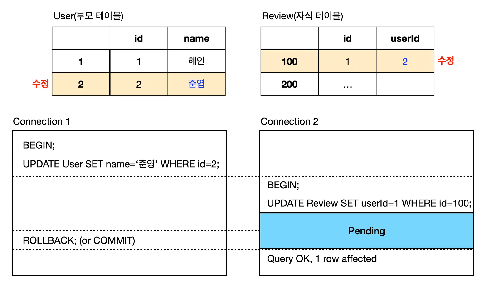
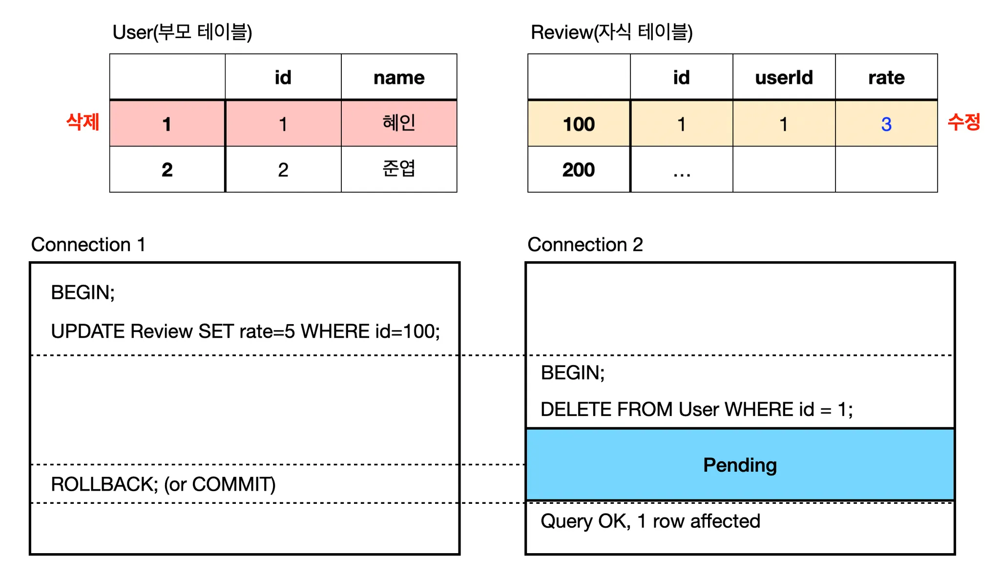

- 유니크 인덱스

  - MySQL 프라이머리 키는 NULL 허용안함

  ### 유니크 인덱스 vs 세컨더리 인덱스

  - 인덱스 읽기
    - 유니크 인덱스 성능 `=` 세컨더리 인덱스 성능
    - 보통 세컨더리 인덱스는 느리다고 생각하는데, 이 때의 인덱스의 성능이 느린 것이 아니라 세컨더리 인덱스는 중복된 값이 허용되므로 `읽어야할 레코드가 많아서 느린 것`
    - 즉, 읽어야 할 레코드 건수가 같다면 유니크 인덱스, 세컨더리 인덱스 성능은 동일
  - 인덱스 쓰기
    - 유니크 인덱스가 더 느리다.
    - 유니크 인덱스는 `중복된 값을 체크하는 단계`가 더 필요하기 때문
    - 중복된 값 체크 시 읽기 잠금, 쓰기 작업 시 쓰기 잠금을 하여 데드락 빈번하게 발생
  - 유니크 인덱스와 세컨더리 인덱스는 역할이 동일하여 중복해서 생성할 필요는 없다
  - 프라이머리 키와 유니크 인덱스를 동일한 칼럼에 생성하는 것은 불필요한 중복이다.

    - 프라이머리 키와 유니크 인덱스를 둔 테이블 예시 - Review 테이블
    
    <aside>
    💡 유일성이 `반드시` 보장되야 한다 → 유니크 인덱스
    유일성이 보장될 필요 없다 → 세컨더리 인덱스

    </aside>

- 외래키

  - 외래키 설정 시 `자동으로 FK 인덱스가 생성`된다.
  - 외래키가 제거되야지만 인덱스 삭제 가능
  - 외래키 관리 포인트
    - 쓰기 잠금이 발생하는 경우 잠금 경합(잠금 대기)이 발생한다.
    - 외래키와 관련없는 칼럼 변경은 최대한 잠금 경합(잠금 대기)을 발생시키지 않는다.

  ### 자식 테이블의 변경이 잠금 대기하는 경우

  - 자식테이블이 외래키 칼럼을 변경하려고할 때 부모 테이블의 레코드에 쓰기잠금이 걸려있을 경우 잠금 해제될 때까지 기다림
  - 외래키 칼럼 외에 다른 칼럼 변경 시에는 잠금 대기가 발생하지 않음
  - example
    

  ### 부모 테이블의 변경 작업이 대기하는 경우

  - 부모 레코드가 삭제되면 자식 레코드도 동시에 삭제되야하기 때문에 자식 레코드에 쓰기 잠금이 걸려있을 경우 잠금 해제될 때까지 기다림
  - 애초에 자식 레코드를 모두 훑어야하므로 잠금 대기가 무조건 발생함
  - example
    
    <aside>
    💡 잠금이 확장되면 전체적으로 쿼리의 동시 처리에 영향을 준다.

    </aside>
