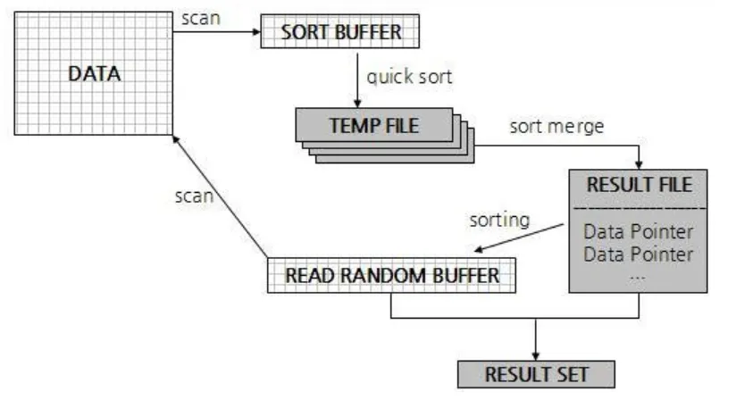

- order by
  9.2.3 ORDER BY 처리 (Using filesort)

  - 대부분의 select쿼리에서 정렬은 필수적으로 사용됨
  - 인덱스 vs filesort
    - 인덱스
      - 이미 인덱스가 정렬돼 있어서 매우 빠르다
      - INSERT, UPDATE, DELETE 작업 시 부가적인 인덱스 추가/삭제 작업이 필요하여 느리다
      - 디스크 공간 더 많이 필요
      - 인덱스 개수가 늘어날수록 innoDB의 버퍼풀에 인덱스를 이용하기 위한 메모리가 많이 필요
    - Filesort
      - 인덱스를 생성하지 않아도 됨
      - 정렬해야 할 레코드가 적으면 충분히 빠르다
      - 정렬 작업이 쿼리 실행 시 처리되어 대상 건수가 많아질수록 응답은 느려진다.
  - 모든 정렬에 인덱스를 이용하는건 거의 불가능 - 정렬 기준이 너무 많아 요건별로 모두 인덱스를 생성하는것이 불가능한 경우 - group by 결과나 distinct (중복제거) 같은 처리의 결과를 정렬하는 경우 - UNION(합집합)처럼 임시 테이블의 결과를 재정렬 하는 경우 - 랜덤하게 결과 레코드를 가져와야 하는 경우

    9.2.3.1 소트 버퍼
    

  - 정렬을 수행하기 위해 별도의 메모리 공간을 할당받는데 이걸 소트 버퍼라고 함
    - 쿼리 실행이 완료되면 즉시 시스템으로 반납된다
  - 정렬할 레코드가 할당된 소트 버퍼만으로 정렬할 수 있다면 다행
    - 정렬할 레코드가 소트 버퍼보다 크다면 여러 조각으로 나눠서 처리하는데, 이 과정에서 디스크를 사용하게된다(읽기, 쓰기)
    - 소트 버퍼에서 정렬 수행 후 결과를 임시로 디스크에 기록
    - 다음 레코드를 가져와서 정렬 후 디스크에 임시 저장
    - 각 버퍼 크기만큼 정렬된 레코드를 다시 병합하여 정렬 수행(멀티머지)
  - 레코드 건수가 많을수록 반복 작업 횟수가 많아진다
    - 소트 버퍼 크기를 늘린다고 더 빨리지진않는다 (실제 벤치마크 결과로 차이는 미미, 1mb 이상부터는 성능이 거의 늘지않음)
    - 리눅스 계열의 운영체제에서는 너무 큰 사이즈를 사용하면 성능이 오히려 떨어질 수 있다
  - 소트 버퍼는 세션 메모리영역에 해당됨 - 여러 클라이언트가 공유해서 사용할 수 있는 영역이 아님 - 커넥션이 많거나 정렬 작업이 많아져서 소트 버퍼로 인해 메모리 낭비가 커지면 운영체제가 강제로 프로세스를 종료할 수도 있다.

    9.2.3.2 정렬 알고리즘

  - 레코드 전체를 소트버퍼에 담을지, 정렬 기준 칼럼만 소트버퍼에 담을지
  - 싱글패스
    - select 대상이 되는 칼럼 전부를 담아서 정렬을 수행하는 정렬 방식
    - 일반적으로 사용되는 방식
  - 투패스
    - 싱글 패스 이전부터 존재하던 방식
    - 정렬대상과 프라이머리 키만을 소트 버퍼에 담아서 정렬 수행 후 순서에 맞게 프라이머리 키로 테이블을 읽어서 나머지 칼럼을 가져오는 방식
    - mysql 8.0에서도 특정 조건에선 투패스 사용
  - 투패스는 테이블을 두 번 읽어야 하지만 싱글패스는 한 번만 읽는다
  - 하지만 싱글패스는 더 많은 소트 버퍼 공간이 필요
  - 다음의 경우엔 투패스를 이용
    - 레코드의 크기가 max_length_for_sort_data 변수에 설정된 값보다 클 때
    - BLOB나 TEXT타입의 컬럼을 SELECT 대상에 포함할 때
