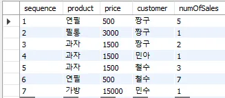
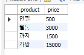

### DISTINCT



```sql
SELECT DISTINCT product, price FROM selling;
```



- 이때 product나 price 둘 중 하나만 유니크하게 조회하는게 아닌 둘의 조합이 유니크하도록 조회
- COUNT(),MIN(),MAX()와 같은 집합 함수의 경우 함수의 인자값으로 전달된 칼럼만 유니크하게 조회
- 인덱스가 아닌 칼럼을 DISTINCT 조회하기 위해서는 임시 테이블이 필요(이 때 실행 계획에서는 Using temporary는 나오지 않음).

### 내부 임시 테이블 활용

- 내부 임시 테이블은 쿼리를 통해 생성한 테이블과 다름. 내부 임시 테이블은 쿼리가 완료되면 자동으로 삭제되며 다른 세션이나 쿼리에서 조회 불가
- 임시 테이블은 처음에는 메모리에 저장했다가 용량이 커지면 디스크에 저장. 8.0 이전 버전에서는 메모리에서는 MEMORY 스토리지 엔진, 디스크에서는 MyISAM 스토리지 엔진 이용했지만, MEMORY 스토리지 엔진이 가변 길이 타입을 지원하지 못해 메모리 낭비가 심해 8.0 버전 부터는 TempTable 스토리지 엔진으로 변경
- 임시 테이블 관련 시스템 변수
  - `internal_tmp_mem_storage_engine` : 메모리에서 사용하는 엔진 종류(MEMORY | TempTable)
  - `temptable_max_ram` : TempTable이 사용가능한 메모리 최대 공간
  - `temptable_use_mmap` : 임시테이블이 메모리에서 디스크로 전환될 때 MMAP 사용 여부(OFF이면 InnoDB 테이블 사용)
- 임시 테이블 관련 상태 변수
  ```sql
  SHOW SESSION STATUS LIKE ‘Created_tmp%’
  ```
  - `Created_tmp_disk_tables` : 디스크에 생성된 임시 테이블 갯수
  - `Created_tmp_tables` : 쿼리 실행하면서 생성된 모든 임시 테이블 갯수
- 임시 테이블이 필요한 쿼리(2개의 테이블을 조인해서 정렬해야하는 경우 필요 - 조인된 결과를 임시테이블에 저장하고 소트 버퍼로 정렬)
  - ORDER_BY 와 GROUP_BY에 명시된 칼럼이 다른 쿼리
  - ORDER_BY 와 GROUP_BY에 명시된 칼럼이 조인의 순서상 첫 번째 테이블이 아닌 쿼리
  - DISTINCT와 ORDER_BY 가 동시에 쿼리에 존재하는 경우
  - DISTINCT가 인덱스로 처리되지 못하는 경우
  - UNION이나 UNION DISTINCT가 사용된 쿼리
  - 쿼리의 실행 계획에서 select_type이 DERIVED인 쿼리
