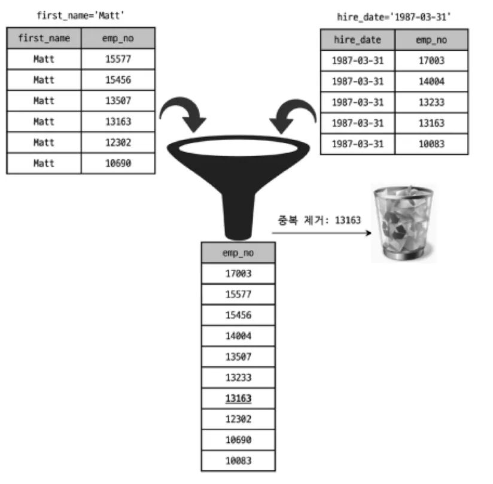

- 인덱스 확장 - 복합 인덱스 기반
  ⇒ 제일 좋은 예시를 보여준 듯: [인덱스 확장 사용](https://myinfrabox.tistory.com/88)
  `use_index_extensions`
  “세컨더리 인덱스에 자동으로 추가된 프라이머리 키를 활용할 수 있을지 결정하는 옵션”

  - 클러스터링 인덱스 → 프라이머리 키로 클러스터링 인덱스 생성 → 모든 세컨더리 인덱스는 리프 노드에 프라이머리 키를 값을 가진다(실제 데이터 찾을 때 프라이머리 키 사용)

  ```sql
  CREATE TABLE dept_emp (
     emp_no INT NOT NULL,
     dept_no CHAR(4) NOT NULL,
     from_date DATE NOT NULL,
     to_date DATE NOT NULL,
     PRIMARY KEY (dept_no, emp_no),
     KEY ix_fromdate (from_date)
  ) ENGINE=InnoDB;
  ```

  - 프라이머리 키: (dept_no, empo_no)
  - 세컨더리 인덱스 ix_fromdate: from_date 칼럼만 포함
    - 세컨더리 인덱스는 데이터 레코드를 찾아가기 위해, 프라이머리 키인 dept_no와 emp_no 칼럼을 순서대로 포함
      → ix_fromdate 인덱스 = (from_date, dept_no, emp_no) 로 인덱스 확장하여 사용함
      (MySQL 서버가 업그레이드되면서 옵티마이저가 인덱스 마지막에 (dept_no, emp_no) 숨은 것 인지)
      Ex) 실행계획 확인

  ```sql
  INSERT INTO dept_emp(emp_no, dept_no, from_data) VALUES
  	(1, 'd003', '1998-01-01'), (1, 'd002', '1999-01-01'),
  	(1, 'd001', '2000-01-01'), (1, 'd004', '2001-01-01'),
  	(1, 'd005', '2002-01-01'), (2, 'd004', '1998-01-01'),
  	(2, 'd003', '1999-01-01'), (2, 'd003', '2000-01-01'),
  	(2, 'd002', '2001-01-01'), (2, 'd005', '2002-01-01'),
  	**(3, 'd001', '1998-01-01')**, (3, 'd002', '1999-01-01'),
  	(3, 'd003', '2000-01-01'), (3, 'd004', '2001-01-01'),
  	(3, 'd005', '2002-01-01'), **(4, 'd001', '1998-01-01'),**
    (4, 'd002', '1999-01-01'), (4, 'd003', '2000-01-01'),
    (4, 'd004', '2001-01-01'), (4, 'd005', '2002-01-01'),
    (5, 'd005', '1998-01-01'), (5, 'd002', '1999-01-01'),
    (5, 'd003', '2000-01-01'), (5, 'd004', '2001-01-01'),
    (5, 'd001', '2002-01-01');
  ```

  ```sql
  mysql> EXPLAIN SELECT COUNT(*) FROM dept_emp WHERE from_date='1998-01-01' AND dept_no='d001';
  +-------------+----------------------+------------------------------------+
  |id | select_type | table    | type | key         | key_len | ref         |
  +-------------+----------------------+------------------------------------+
  | 1 | SIMPLE      | dept_emp | ref  | ix_fromdate | 19      | const,const |
  +-------------+----------------------+------------------------------------+

  mysql> EXPLAIN SELECT COUNT(*) FROM dept_emp WHERE from_date='1987-07-25';
  +-------------+----------------------+------------------------------+
  |id | select_type | table    | type | key         | key_len | ref   |
  +-------------+----------------------+------------------------------+
  | 1 | SIMPLE      | dept_emp | ref  | ix_fromdate | 3       | const |
  +-------------+----------------------+------------------------------+
  ```

  - 옵티마이저는 쿼리의 WHERE 절에 따라 인덱스의 확장 보조 인덱스를 활용할 수 있다
    (복합 인덱스 `ix_fromdate`가 `from_data`와 `dept_no` 컬럼을 포함)
  - 첫번째 쿼리
    - `from_data`와 `dept_no` 컬럼을 모두 사용하여 `dept_emp` 테이블에서 데이터를 검색
    - `key_len`이 19바이트인 것은, `from_data`와 `dept_no` 두 컬럼을 모두 인덱스 검색에 사용했다는 의미
      → rows: 2 / 인덱스 확장 안쓰면 rows: 5
  - 두번째 쿼리
    - `from_data`만을 조건으로 사용
    - `key_len`이 3바이트(date타입)로 표시되는 것은, 오직 `from_data` 컬럼만 인덱스 검색에 사용
      → 즉, 세컨더리 인덱스인 `ix_fromdate`가 가진 프라이머리 키를 첫번째 쿼리에서 활용할 수 있다고 판단하고 인덱스 확장 사용
      ⇒ 적절한 컬럼으로 구성된 `복합 인덱스`를 사용하여(인덱스확장) 데이터 접근 시 필요한 디스크 I/O 작업 줄여서 성능향상

- 인덱스 머지 - 단일 인덱스 기반
  “하나의 테이블에 대해 2개 이상의 인덱스를 이용하여 쿼리를 처리”
  → 여러 개의 `단일 컬럼 인덱스`를 결합하여 하나의 쿼리에서 사용

  - 대부분의 옵티마이저는 테이블별로 하나의 인덱스만 사용하도록 실행 계획을 수립함 - WHERE 조건이 여러 개 있더라도 하나의 인덱스에 포함된 칼럼에 대한 조건만으로 인덱스를 검색하고, 나머지 조건은 읽어온 레코드에 대해서 체크 - ex. 인덱스 머지 실행계획이 적용되지 않을 경우 1. emp_no BETWEEN 10000 AND 20000(프라이머리 키) 검색 2. 1번 조건으로 읽어온 레코드에서 first_name='Georgi' 검색
    `sql
SELECT *
	FROM employees
	WHERE first_name='Georgi' AND emp_no BETWEEN 10000 AND 20000;
`
    ⇒ 하나의 인덱스만 사용해서 작업 범위를 충분히 줄일 수 있는 경우라면 테이블별로 하나의 인덱스만 활용하는 것이 효율적
    But, 쿼리에 사용된 각 조건이 서로 다른 인덱스를 사용할 수 있고, 그 조건을 만족하는 레코드 건수가 많을 때는 **MySQL 서버가 인덱스 머지 실행 계획을 선택**
  - 교집합(`index_merge_intersection`)

    ```sql
    EXPLAIN SELECT *
    	FROM employees
    	WHERE first_name='Georgi' AND emp_no BETWEEN 10000 AND 20000;
    ```

    - first_name, emp_no 컬럼 모두 인덱스 → (ix_firstname, PRIMARY)
    - 옵티마이저가 ix_firstname과 PRIMARY 키를 모두 사용해서 쿼리를 처리하기로 결정

    ```sql
    +-------------+----------------------+----------------------------------------------------+
    |type         | key                  | Extra                                              |
    +-------------+----------------------+----------------------------------------------------+
    | index_merge | ix_firstname,PRIMARY | Using intersect(ix_firstname,PRIMARY); Using where |
    +-------------+----------------------+----------------------------------------------------+
    ```

    - Extra 컬럼 Using intersect
      - 실행된 쿼리가 여러개의 인덱스를 검색해서 그 결과의 교집합만 반환했다는 뜻
    - 인덱스 머지 실행 계획을 적용하지 않았을 경우
      - “first_name=’Georgi’” 조건만 인덱스
        - 253건을 읽어와서 emp_no 칼럼의 조건에 일치하는 레코드들만 반환
      - “emp_no BETWEEN 10000 AND 20000” 조건만 인덱스
        - 10,000건을 읽어와서 “first_name=’Georgi’” 조건에 일치하는 레코드만 반환
    - 인덱스 머지 실행 계획 적용 시

      1. first_name='Georgi' 결과의 행의 위치를 모두 찾기
      2. emp_no BETWEEN 10000 AND 20000 결과의 행의 위치 찾기
      3. 두 인덱스 조건을 모두 만족하는 행의 위치(교집합)를 계산

         ⇒ 교집합에 해당하는 실제 데이터를 테이블에서 검색 (실제 데이터 I/O는 14가 될것)

    - 옵티마이저가 인덱스 머지 실행 계획을 세운 이유

      ```sql
      mysql> SELECT COUNT(*) FROM employees
      				 WHERE first_name='Georgi' AND emp_no BETWEEN 10000 AND 20000;

      +----------+
      | COUNT(*) |
      +----------+
      |       14 |
      +----------+
      ```

      ⇒ 두 조건을 모두 만족하는 레코드 건수는 14건 → 14번만 의미 있는 작업

      - “first_name=’Georgi’” 조건만 인덱스 → 253건 버림
      - “emp_no BETWEEN 10000 AND 20000” 조건만 인덱스 → 9986건 버림

    - “세컨더리 인덱스는 리프 노드에 프라이머리 키를 가진다” (**인덱스 확장**)
      = ix_firstname 인덱스는 프라이머리 키인 emo_no 칼럼을 자동으로 포함
      - ix_firstname 인덱스만 사용하는 것이 더 성능이 좋을 것으로 생각할 수도 있음
        → `index_merge_intersection` 최적화를 비활성화(책의 코드 참고)

  - 합집합(`index_merge_union`)
    ```sql
    SELECT *
    	FROM employees
    	WHERE first_name='Matt' OR hire_date='1987-03-31';
    ```
    - first_name, hire_date 컬럼 각각 인덱스 → ix_firstname, ix_firstname
    - 옵티마이저가 ix_firstname과 ix_firstname를 모두 사용해서 쿼리를 처리하기로 결정
    ```sql
    +-------------+--------------------------+----------------------------------------+
    |type         | key                      | Extra                                  |
    +-------------+--------------------------+----------------------------------------+
    | index_merge | ix_firstname,ix_hiredate | Using union(ix_firstname,ix_hiredate); |
    +-------------+--------------------------+----------------------------------------+
    ```
    - 쿼리의 실행 계획은 “Using union” 최적화를 사용
    - ix_firstname 인덱스의 검색 결과와 ix_hiredate 인덱스 검색 결과를 `Union 알고리즘`으로 병합
    - `Union 알고리즘`
      
      - 쿼리의 결과에서 emp_no가 중복되지 않음
        - MySQL 서버에서 두 결과 집합을 정렬해서 중복 레코드를 제거했을 거라 예상하지만,
          정렬 했다는 내용이 실행 계획에는 없음
        - MySQL 서버는 first_name 조건 검색 결과와 hire_date 검색 결과가 프라이머리 키로 이미 정렬되어 있다는 걸 알고 있음
        - 정렬된 두 집합의 결과를 하나씩 가져와서 중복 제거를 수행 → 우선순위 큐(Priority Queue) 알고리즘
  - 정렬 후 합집합(`index_merge_sort_union`)
    - 만약 따로 정렬이 필요한 경우
      - 인덱스 머지 최적화의 ‘Sort union’ 알고리즘을 사용
      ```sql
      EXPLAIN
      	SELECT * FROM employees
      	WHERE first_name='Matt'
      	OR hire_date BETWEEN '1987-03-01' AND '1987-03-31'
      ```
      - 쿼리를 2개로 분리해서 생각
      ```sql
      SELECT * FROM employees WHERE first_name='Matt';
      SELECT * FROM employees WHERE hire_date BETWEEN '1987-03-01' AND '1987-03-31'';
      ```
      - 첫 번째 쿼리 결과는 emp_no 로 정렬되어 출력
      - 두 번째 쿼리 결과는 emp_no 칼럼으로 정렬되어 있지 않음(범위 검색으로 프라이머리로 정렬되어있지 않을 수 있음)
        → 중복 제거하기 위한 우선순위 큐를 사용하는 것이 불가능
        ⇒ MySQL 서버는 두 집합의 결과에서 중복을 제거하기 위해, 각 집합을 emp_no 칼럼으로 정렬한 다음, 중복 제거를 수행
        (Extra 칼럼에 “Using sort_union”)
