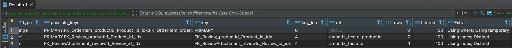
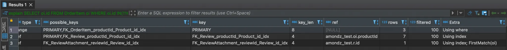
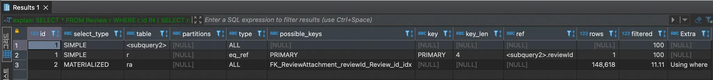
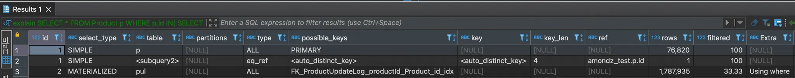
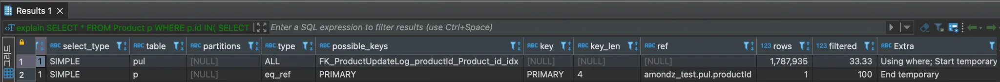
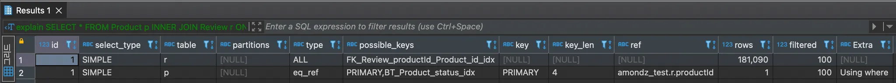
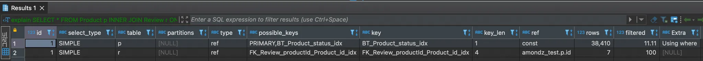

## (참고)옵티마이저 시스템 변수

```sql
// 옵티마이저 시스템 변수 확인하기
SELECT @@optimizer_switch;

#index_merge=on,
#index_merge_union=on,
#index_merge_sort_union=on,
#index_merge_intersection=on,
#engine_condition_pushdown=on,
#index_condition_pushdown=on,
#mrr=on,mrr_cost_based=on,
#block_nested_loop=on,
#batched_key_access=off,
#materialization=on,                // Meterialization(구체화)
#semijoin=on,
#loosescan=on,
#firstmatch=on,                     // First Match
#duplicateweedout=on,
#subquery_materialization_cost_based=on,
#use_index_extensions=on,
#condition_fanout_filter=on,
#derived_merge=on,
#use_invisible_indexes=off,
#skip_scan=on,
#hash_join=on,
#subquery_to_derived=off,
#prefer_ordering_index=on,
#hypergraph_optimizer=off,
#derived_condition_pushdown=on
```

## 9.3.1.11 FirstMatch(퍼스트 매치)

- 방금 쿼리 튜닝하다 어쩌다 쿼리문에 퍼스트 매치를 만나버림 - 기록용
- 아래 두 예시는 동일한 데이터를 가져오는 쿼리문으로 DISTINCT를 활용하냐 EXSISTS를 활용하냐의 차이
  ```tsx
  // 1번 쿼리 - FirstMatch 아님
  explain
  SELECT DISTINCT oi.id
  FROM OrderItem oi
  INNER JOIN Review r ON r.productId = oi.productId
  INNER JOIN ReviewAttachment ra ON ra.reviewId = r.id
  WHERE oi.id IN(-, -, -);
  ```
  
  ```tsx
  // 2번 쿼리 - FirstMatch
  explain
  SELECT oi.id
  FROM OrderItem oi
  WHERE oi.id IN(-, -, -) AND EXISTS(
  	SELECT *
  	FROM Review r
  	INNER JOIN ReviewAttachment ra ON ra.reviewId = r.id
  	WHERE r.productId = oi.productId
  );
  ```
  

## 9.3.1.13 Materialization(구체화)

- 세미 조인에 사용된 서브 쿼리를 통째로 구체화하여 쿼리를 최적화한다.
- 드라이빙 테이블에 조건이 없어 풀 스캔해야할 경우 서브 쿼리 구체화 최적화가 일어난다.
- 내부 임시테이블을 생성한다.
- example
  ```sql
  explain
  SELECT *
  FROM Review r             # 드라이빙 테이블에 서브 쿼리 이외에 추가된 조건 없음
  WHERE r.id IN (
  	SELECT ra.reviewId
  	FROM ReviewAttachment ra
  	WHERE ra.`path` LIKE '%square-images%'
  );
  ```
  
  1. 서브 쿼리가 먼저 실행되어 임시 테이블 <subquery2>가 생성됨
  2. 임시테이블(<subquery2>)와 Review 테이블을 조인하여 결과 반환
- 서브 쿼리에 GROUP BY절이 있어도 Materialization 전략을 사용할 수 있다.

### Materialization 특성

- IN(subquery)에서 서브쿼리는 단독 서브쿼리여야한다.

  - 단독 서브쿼리와 상관 서브쿼리

    - 단독 서브쿼리 → 서브쿼리 내에서 드라이빙 테이블의 칼럼을 참조하지 않고 단독으로 실행 가능
    - 상관 서브쿼리 → 서브쿼리 내에서 드라이빙 테이블의 칼럼을 참조하여 단독으로 실행 불가능

    ```sql
    // 단독 서브쿼리
    SELECT *
    FROM Review r
    WHERE r.id IN (
    	SELECT ra.reviewId
    	FROM ReviewAttachment ra
    	WHERE ra.`path` LIKE '%square-images%'     # 조건문이 드라이빙 테이블과 연관 없음
    );

    // 상관 서브쿼리
    SELECT *
    FROM Review r
    WHERE r.id IN (
    	SELECT ra.reviewId
    	FROM ReviewAttachment ra
    	WHERE ra.createDate = r.createDate         # 조건문에 드라이빙 테이블의 칼럼을 활용함
    );
    ```

- 서브쿼리는 GROUP BY나 집합함수들이 사용되어도 구체화를 사용할 수 있다.
- 구체화가 사용된 경우 내부 임시 테이블이 사용된다.

### Materialization 설정

- [optimizer_switch 시스템 변수](https://www.notion.so/Chapter9-3-1-13-9-4-2-12-part-2-8cd6777a5f0d41e9a66d7ae297afac23?pvs=21)에서 아래 두 옵션이 활성화되어있어야 함(MySQL 8.0 기본값은 모두 ON)
  - semijoin 옵션 = ON
  - materialization 옵션 = ON
- Materialization 최적화를 비활성화하고 싶은 경우 materialization 옵션만 OFF 해주면 된다.
    <aside>
    💡 단, 세미조인이 아닌 서브 쿼리의 최적화에서도 구체화를 이용한 최적화가 사용될 수 있기 때문에 materialization 옵션이 비활성화된 경우 최적화를 사용하지 못한다.
    
    </aside>

## 9.3.1.14 Duplicated Weed-out(중복 제거)

- 세미 조인 서브쿼리를 INNER JOIN쿼리로 바꾸고 중복 레코드를 제거한다.
- example(book) - 중복 제거 최적화가 일어나는 방식

  ```sql
  # 원본 쿼리문 - Salaries테이블에 매달 급여가 쌓여있다면 emp_no에 해당하는 중복되는 데이터가 많을 것
  SELECT *
  FROM Employees e
  WHERE e.emp_no IN(
  	SELECT s.emp_no
  	FROM Salaries s
  	WHERE s.salary > 150000
  );

  # 중복 제거 최적화가 적용된 쿼리문 - INNER JOIN절과 GROUP BY절로 변경되었다.
  # 1. Salaries 테이블을 스캔하여 salary가 150000를 초과한 사원을 검색하고 Employees와 테이블 조인 실행
  # 2. 조인된 결과를 임시 테이블에 저장
  # 3. 임시 테이블에서 중복된 emp_no 기준으로 중복 제거 - GROUP BY 때문에 가장 첫 번째 데이터를 기준으로 나머지 제거
  # 4. 중복 제거 후 남은 레코드 반환
  SELECT
  FROM Employees e, Salaries s
  WHERE e.emp_no=s.emp_no AND s.salary > 150000
  GROUP BY e.emp_no;
  ```

    <aside>
    💡 INNER JOIN 절로 변경되면서  임시 테이블이 생성되었고
    GROUP BY절로 변경되면서 중복 레코드가 제거되었다.
    
    </aside>
    
    - 사실상 1, 2번은 반복적으로 실행되는 작업인데, Explain시 Extra에서 아래와 같은 문구를 볼 수 있다.
        - 반복 작업이 시작되는 실행계획에는 “start temporary”
        - 반복 작업이 끝나는 실행계획에는 “End temporary”
        - 즉, 이 구간이 중복 제거 최적화 처리 과정이다.
        → 중복 제거가 일어나지 않았는데? 1-3번 까지의 과정이지 않을까 싶다.

- example(test) - materialization = OFF 한 상태로 실행
    <aside>
    💡 Duplicated weed-out 최적화 방식의 우선순위가 다소 밀리다보니 테스트를 하려면 optimizer_switch 시스템 변수의 다른 최적화 방식들을 OFF 해주어야한다.
    → 정확한 우선순위는 잘 모르겠음
    
    </aside>
    
    ```sql
    explain
    SELECT *
    FROM Product p 
    WHERE p.id IN(
    	SELECT pul.productId 
    	FROM ProductUpdateLog pul 
    	WHERE pul.originPrice > 100000
    )
    LIMIT 10, 10;
    ```
    
    - materialization이 ON인 상태에서는 아래 쿼리문 실행 시 materialization 최적화 방식을 선택함
        
        
        
    - materialization = OFF 일 경우
        
        
        
    - materialization과 duplicated weed-out 최적화 방식의 속도 차이
        - materialization = 35-40s 소요
        - duplicated weed-out = 20ms 소요
        - 만약 서브 쿼리 테이블의 데이터가 많을 경우 duplicated weed-out 방식이 더 빠르다.
        - 서브 쿼리 테이블의 데이터가 많을 경우 materialization은 풀 스캔을 진행하는데 duplicated weed-out의 경우 쿼리문을 최적화하고 수행하기 때문에 속도 측면에서 훨씬 빠른 것 같다.
        
        <aside>
        💡 materialization이 duplicated weed-out보다 우선순위가 높은 것으로 보아,
        최대한 작업자가 서브 쿼리 테이블을 고려하여 최적화된 쿼리문을 옵티마이저에게 넘겨주는 것이 좋을 것 같다.
        
        </aside>

### Duplicated Weed-out 특성

- 단독 혹은 상관 서브 쿼리 모두 적용 가능하다.
- 서브 쿼리에 GROUP BY나 집합 함수가 사용된 경우 적용할 수 없다.
- 테이블을 JOIN으로 처리하기 때문에 최적화할 수 있는 방법이 많다.

## 9.3.1.15 컨디션 팬아웃(Condition_fanout_filter)

- 테이블의 순서는 쿼리의 성능에 영향을 준다. (ex. 드라이빙 테이블에 담겨진 데이터의 양이 많냐 적냐에 따라 다름)
- 옵티마이저는 여러 테이블이 JOIN되는 경우 일치하는 레코드 건수가 적은 순서대로 JOIN을 실행한다.
- example(test)
  ```tsx
  explain
  SELECT *
  FROM Product p
  INNER JOIN Review r ON r.productId = p.id
  WHERE p.status = 2 AND p.createDate BETWEEN '2024-01-01' AND '2024-03-04';
  ```
  - condition_fanout_filter = OFF
    - rows = 181,090(개), filtered = 100(%)
    - 즉, 181,090개의 레코드를 읽고 해당 레코드들이 모두 조건문을 만족할 것이라고 예측함
      
  - condition_fanout_filter = ON
    - rows=38,410(개), filtered=11.11(%)
    - 즉, 38,410개의 레코드를 읽고 해당 레코드들 중 11.11%만이 조건문을 만족할 것이라고 예측함
      
  - 결국, 옵티마이저가 p.status 조건 외에 나머지 조건에 대해서도 얼마나 충족될 지 고려하였다.
      <aside>
      💡 옵티마이저가 조건에 만족하는 레코드 건수를 정확하게 예측한다면 더 빠른 실행 계획이 세워질 수 있다.
      
      </aside>

### 옵티마이저가 최적화 비율을 계산할 수 있는 조건

- WHERE 조건절에 사용된 칼럼에 인덱스가 있는 경우
- WHERE 조건절에 사용된 칼럼에 히스토그램이 존재하는 경우
  - 히스토그램
    - 특정 명령에 의해 수동으로 수집되는 통계 정보
    - 레코드 건수나 칼럼 값의 범위를 관리한다.
    - 주로 인덱스되지 않은 칼럼에 대한 데이터 분포도를 참조하는 용도로 사용된다.
      → 뒤에 히스토그램 내용이 나올 듯. 여기서는 이 정도까지만 알아도 될 것 같다.

### condition_fanout_filter 최적화 특징

- 정교한 계산을 위해 실행 계획 수립에 더 많은 시간과 컴퓨팅 자원을 사용한다.
- 간단한 쿼리이거나 잘못된 실행 계획을 성립한 적이 없는 쿼리문의 경우 condition_fanout_filter 최적화 방식은 큰 도움이 되지 않는다.

<aside>
💡 옵티마이저가 실행 계획 수립 시 인덱스 통계 정보 외에도 아래 순서대로 사용 가능한 방식을 선택한다.
1. Range Optimizer를 이용한 예측
2. 히스토그램을 이용한 예측
3. 인덱스 통계를 이용한 예측
4. 추측에 기반한 예측

Range Optimizer

- 실행 계획 수립 단계에서 빠르게 소량의 실제 인덱스 데이터를 읽어본다.
- 인덱스를 이용해서 수행될 수 있을 경우에만 사용된다.

</aside>

## 9.3.1.16 파생 테이블 머지(derived_merge)

- 파생 테이블이 머지되는 방식
  ```tsx
  SELECT *
  FROM (
    SELECT * FROM employees WHERE first_name = 'Matt'  // 파생 테이블
  ) derived_table
  WHERE derived_table.hire_date = '1986-04-03';
  ```
  - FROM절에 사용된 서브 쿼리를 먼저 실행하고 그 결과를 파생 테이블로 만듦.
  - 파생 테이블을 다시 읽어서 외부 조건에 맞는 데이터만 반환
- 파생 테이블이 생성되고 다시 읽는 동작을 수행하기 때문에 레코드 읽기/쓰기 오버헤드가 더 추가된다.
- 처음에는 임시 테이블에 저장하지만 레코드 수가 커지면 디스크에 기록되게 되어 쿼리의 성능이 저하된다.
    <aside>
    💡 MySQL 8.0 이전
    - 메모리에 생성되는 임시테이블은 MEMORY 스토리지 엔진 사용  
    - 디스크에 생성되는 임시테이블은 MyISAM 스토리지 엔진 사용
    
    MySQL 8.0 이후
    - 메모리에 생성되는 임시테이블은 TempTable이라는 새로운 스토리지 엔진 사용
    - 디스크에 생성되는 임시테이블은 InnoDB 스토리지 엔진 사용
    
    </aside>

- 단, 옵티마이저가 자동으로 파생 테이블을 생성하여 머지할 수 없는 경우
    <aside>
    💡 이 때에는 작업자가 직접 병합한 쿼리문을 작성하여 요청해야함
    
    </aside>
    
    - SUM(), MIN(), MAX()와 같은 집계함수와 윈도우 함수(Window Function)가 사용된 서브 쿼리
    - DSTINCT가 사용된 서브쿼리
    - GROUP BY나 HAVING이 사용된 서브쿼리
    - LIMIT이 사용된 서브쿼리
    - UNION 또는 UNION ALL을 포함하는 서브쿼리
    - SELECT 절에 사용된 서브쿼리
    - 값이 변경되는 사용자 변수가 사용된 서브쿼리
