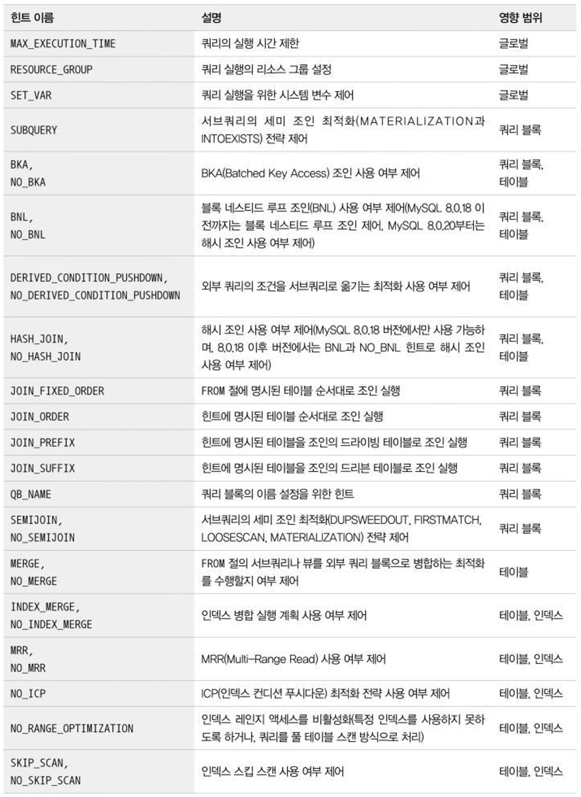

- 옵티마이저 힌트
  ⇒ SQL 쿼리를 작성할 때 데이터베이스 쿼리 옵티마이저에게 제공하는 지시사항이나 제안
  → 성능을 향상시키기 위해 특정 방식으로 쿼리를 실행하도록 옵티마이저를 유도
  keypoint, 기본적으로 옵티마이저가 동일한 기능을 수행하고 있을 수 있다. 아주 세밀한 조정이 필요할 경우에 의미가 있다
  **옵티마이저 힌트 종류**

  - 힌트의 종류
    
  - 영향 범위에 따라 4개의 그룹으로 나눠볼 수 있음
    - **인덱스**: 특정 인덱스의 이름을 사용할 수 있는 옵티마이저 힌트
      ```sql
      # employees 테이블에 대한 쿼리 실행 시 index_name 인덱스를 사용하도록
      SELECT /*+ INDEX(e index_name) */ * FROM employees e WHERE department_id = 101;
      ```
    - **테이블**: 특정 테이블의 이름을 사용할 수 있는 옵티마이저 힌트
      ```sql
      # 인덱스 수준의 힌트와 비슷하게 보일 수 있지만, 이는 테이블의 처리 방식에 더 집중
      # 특정 테이블을 스트레이트 조인(Straight Join) 순서로 처리
      SELECT /*+ STRAIGHT_JOIN */ * FROM myTable1, myTable2 WHERE myTable1.id = myTable2.id;
      ```
      - **`/*+ STRAIGHT_JOIN */`**
        - 쿼리의 FROM 절에 나열된 테이블들을 명시된 순서대로 조인하도록 옵티마이저에게 조언하는 테이블 수준의 힌트
    - **쿼리 블록**: 특정 쿼리 블록에 사용할 수 있는 옵티마이저 힌트로서, 특정 쿼리 블록의 이름을 명시하는 것이 아니라 힌트가 명시된 쿼리 블록에 대해서만 영향을 미치는 옵티마이저 힌트
      ```sql
      # 복잡한 쿼리에서 특정 서브쿼리에 이름을 부여하고,
      # 그 서브쿼리에 대한 힌트를 적용하고 싶을 때 QB_NAME() 힌트를 사용
      SELECT /*+ QB_NAME(qb1) */ * FROM (SELECT * FROM Product) AS qb1;
      ```
    - **글로벌(쿼리 전체)**: 전체 쿼리에 대해서 영향을 미치는 힌트
      ```sql
      # 쿼리의 최대 실행 시간을 설정하고자
      SELECT /*+ MAX_EXECUTION_TIME(1000) */ * FROM Product;
      ```
  - 힌트에 인덱스 이름이 명시될 수 있는 경우를 인덱스 수준의 힌트로 구분하고,
  - 테이블 이름까지만 명시될 수 있는 경우를 테이블 수준의 힌트로 구분
  - 인덱스의 이름을 모두 명시할 수도 있지만 인덱스의 이름을 명시하지 않고 테이블 이름만 명시할 수도 있는데, 이런 경우는 인덱스와 테이블 수준의 힌트
  - 모든 인덱스 수준의 힌트는 반드시 테이블명이 선행돼야 한다. 예를 들어, 인덱스 수준의 옵티마이저 힌트인 INDEX 힌트를 사용하는 경우 사용할 인덱스명을 사용해야 한다.
  - 하나의 SQL 문장에서 SELECT 키워드는 여러 번 사용될 수 있다.
    - 각 SELECT 키워드로 시작하는 서브쿼리 영역을 쿼리 블록이라고 한다.
    - 특정 쿼리 블록에 영향을 미치는 옵티마이저 힌트는 그 쿼리 블록 내에서 사용될 수도 있지만 외부 쿼리 블록에서 사용할 수도 있다.
  - 이처럼 특정 쿼리 블록을 외부 쿼 리 블록에서 사용하려면 QB_NAME() 힌트를 이용해 해당 쿼리 블록에 이름을 부여해야 한다.
    **MAX_EXECUTION_TIME**
  - 옵티마이저 힌트 중에서 유일하게 쿼리의 실행 계획에 영향을 미치지 않는 힌트
  - 단순히 쿼리의 최대 실행 시간을 설정하는 힌트
    (밀리초 단위의 시간을 설정)
  - 쿼리가 지정된 시간을 초과 실패
    **SET_VAR**
  - 옵티마이저 힌트뿐만 아니라 MySQL 서버의 시스템 변수들 또한 쿼리의 실행 계획에 상당한 영향을 미침
  - 대표적으로 조인 버퍼의 크기를 설정하는 join_buffer_size 시스템 변수의 경우 쿼리에 아무런 영향을 미치지 않을 것처럼 보인다.
    - 하지만 옵티마이저는 조인 버퍼의 공간이 충분하면 조인 버퍼를 활용하는 형태의 실행 계획을 선택할 수도 있음
    - 그뿐만 아니라 옵티마이저 힌트로 부족한 경우 optimizer_switch 시스템 변수를 제어해야 할 수도 있다.
  - SET_VAR 힌트는 실행 계획을 바꾸는 용도뿐만 아니라 조인 버퍼나 정렬용 버퍼(소트 버퍼)의 크기를 일시적으로 증가시켜 대용량 처리 쿼리의 성능을 향상시키는 용도로도 사용할 수 있다.

    ```sql
    # 조인 버퍼의 크기를 256MB로 설정, 메모리 내에서 더 많은 데이터를 처리
    SELECT /*+ SET_VAR(join_buffer_size=1024 * 1024 * 256) */
        *
    FROM
        orders
    JOIN
        order_details ON orders.order_id = order_details.order_id
    WHERE
        orders.order_date BETWEEN '2021-01-01' AND '2021-12-31';

    # 쿼리 실행 동안 특정 시스템 변수의 값을 일시적으로 변경하고자 할 때
    # sort_buffer_size의 크기를 증가
    SELECT /*+ SET_VAR(sort_buffer_size=1048576) */ * FROM Product;
    ```

    **SEMIJOIN & NO_SEMIJOIN**

  - SEMIJOIN 힌트는 세미 조인의 최적화 전략 중 어떤 세부 전략을 사용할지를 제어
    → 원래는 자동으로 됨
    | 최적화 전략 | 힌트 |
    | ------------------------- | --------------- |
    | SEMIJOIN(DUPSWEEDOUT) | First Match |
    | SEMIJOIN(FIRSTMATCH) | Loose Scan |
    | SEMIJOIN(LOOSESCAN) | Materialization |
    | SEMIJOIN(MATERIALIZATION) | Table |
    | **Pull-out** | **없음** |
  - `Table Pull-out` 최적화 전략은 별도로 힌트를 사용할 수 없다.
    -> `Table Pull-out` 전략은 그 전략을 사용할 수 있다면 항상 더 나은 성능을 보장하기 때문

    - `Table Pull-out` 사용하기 위해 쿼리 구성
      1. 서브쿼리에서 단일 테이블
      2. 서브쿼리가 메인 쿼리의 조인 조건이나 WHERE 절 조건과 밀접하게 연관
    - 하지만 다른 최적화 전략들은 상황에 따라 다른 최적화 전략으로 우회하는 것이 더 나은 성능을 낼 수도 있기 때문에 NO_SEMIJOIN 힌트도 제공되는 것
      → SEMIJOIN 전략: 조인 결과로 반환되는 행의 수가 상대적으로 적어야 효과적 어쨋든 자동으로 최적화하니까 복잡성을 만들수도 있다

    ```sql
    # 세미 조인의 DUPSWEEDOUT 전략을 사용
    SELECT /*+ SEMIJOIN(@DUPSWEEDOUT) */ * FROM Product WHERE id IN (SELECT productId FROM ProductOption);
    # NO_SEMIJOIN
    SELECT /*+ NO_SEMIJOIN */ p.* FROM Product p ...

    ```

    **SUBQUERY**

  - 서브쿼리 최적화는 세미 조인 최적화가 사용되지 못할 때 사용하는 최적화 방법
  - 서브쿼리는 2가지 형태로 최적화할 수 있다.
    | 최적화 전략 | 힌트 |
    | --------------- | ------------------------- |
    | IN-to-EXISTS | SUBQUERY(INTOEXISTS) |
    | Materialization | SUBQUERY(MATERIALIZATION) |
  - 세미 조인 최적화는 주로 IN(subquery) 형태의 쿼리에 사용될 수 있지만 안티 세미 조인(Anti Semi Join)의 최적화에는 사용될 수 없다.
  - 서브쿼리 최적화 힌트는 세미 조인 최적화 힌트와 비슷한 형태
    - 서브쿼리에 힌트를 사용하거나 서브쿼리에 쿼리 블록 이름을 지정해서 외부 쿼리 블록에서 최적화 방법을 명시하면 됨
  - IN-to-EXISTS
    - **`IN`** 절을 포함한 쿼리를 **`EXISTS`** 절을 사용하는 쿼리로 변환하는 기법
    - **`IN`** 절은 서브쿼리에서 반환된 모든 값들을 메인 쿼리의 조건과 비교 → 결과 세트가 클 경우 많은 비교 연산이 필요
    - **`EXISTS`**는 일치하는 첫 번째 결과를 찾는 즉시 나머지 검사를 중단하기 때문에, 특히 서브쿼리 결과가 큰 경우 더 빠른 성능을 제공
  - Materialization
    - 서브쿼리를 한 번 실행하여 그 결과를 임시 테이블로 저장하고, 이후의 연산에서는 이 임시 테이블을 바로 참조하여 성능을 향상
    ```sql
    # IN-to-EXISTS 전략을 사용
    SELECT /*+ SUBQUERY(@INTOEXISTS) */ * FROM Product WHERE id IN (SELECT productId FROM ProductOption);
    ```
    **BNL & NO_BNL & HASHJOIN & NO_HASHJOIN**
  - MySQL 8.0.18 버전부터는 새롭게 도입된 `해시 조인 알고리즘`이 블록 네스티드 루프 조인을 대체하도록 개선됐다.
  - 그런데도 BNL 힌트와 NO_BNL 힌트는 MySQL 8.0.20과 그 이 후의 버전에서도 여전히 사용 가능함
    - MySQL 8.0.20 버전과 그 이후 버전에서는 BNL 힌트를 사용하면 해시 조인을 사용하도록 유도하는 힌트로 용도가 변경
  - HASHJOIN과 NO_HASHJOIN 힌트는 MySQL 8.0.18 버전에서만 유효하며, 그 이후 버전에서는 효력이 없다.
    **JOIN_FIXED_ORDER & JOIN_ORDER & JOIN_PREFIX & JOIN_SUFFIX**
  - MySQL 서버에서는 조인의 순서를 결정하기 위해 전통적으로 STRAIGHT_JOIN 힌트를 사용
  - 하지만 STRAIGHT_JOIN 힌트는 우선 쿼리의 FROM 절에 사용된 테이블의 순서를 조인 순서에 맞게 변경해야 하는 번거로움이 있음
  - 또한 STRAIGHT_JOIN은 한 번 사용되면 FROM 절에 명시된 모든 테이블의 조인 순서가 결정되기 때문에 일부는 조인 순서를 강제하고 나머지는 옵티마이저에게 순서를 결정하게 맞기는 것이 불가능 함
  - 이런 단점들을 보완하기 위해 STRAIGHT_JOIN과 동일한 힌트까지 포함해서 다음과 같이 4개의 힌트를 제공

    - JOIN_FIXED_ORDER
      - STRAIGHT_JOIN 힌트와 동일하게 FROM 절의 테이블 순서대로 조인을 실행하게 하는 힌트
    - JOIN_ORDER
      - FROM 절에 사용된 테이블의 순서가 아니라 힌트에 명시된 테이블의 순서대로 조인을 실행하는 힌트
    - JOIN_PREFIX
      - 조인에서 드라이빙 테이블만 강제하는 힌트 → 가장 앞으로
    - JOIN_SUFFIX
      - 조인에서 드리븐 테이블(가장 마지막에 조인돼야 할 테이블들)만 강제하는 힌트 → 가장 뒤로
        +>> **Driving Table**
    - 조인 연산에서 먼저 스캔되는 테이블, 조인의 "출발점"
    - 드라이빙 테이블의 선택
      - 더 작은 결과 세트를 생성할 것으로 예상되는 테이블
      - 인덱스를 효율적으로 활용할 수 있는 테이블
      - 조인 조건에 가장 적합한 필터링을 제공하는 테이블
        **Driven Table**
    - 드리븐 테이블은 드라이빙 테이블의 스캔 결과와 조인 조건에 따라 나중에 스캔되는 테이블
    - 드라이빙 테이블에서 얻은 데이터를 바탕으로, 드리븐 테이블에서 조인 조건과 일치하는 행을 검색
    - 드리븐 테이블은 조인 연산의 "목적지"

    ```sql
    # JOIN의 순서를 고정하고 싶을 때, JOIN_FIXED_ORDER를 사용
    # Product와 ProductOption 테이블을 조인할 때의 순서를 고정
    SELECT /*+ JOIN_FIXED_ORDER */ * FROM Product JOIN ProductOption ON Product.id = ProductOption.productId;

    SELECT /*+ JOIN_ORDER(B, A, C) */ * FROM FROM A JOIN B ON A.id = B.A_id JOIN C ON A.id = C.A_id;
    ```

    **MERGE & NO_MERGE**

  - 예전 버전의 MySQL 서버에서는 FROM 절에 사용된 서브쿼리를 항상 내부 임시 테이블로 생성함
  - 생성된 내부 임시 테이블을 파생 테이블(Derived table)이라고 하는데, 이는 불필요한 자원 소모 를 유발
  - 그래서 MySQL 5.7과 8.0 버전에서는 가능하면 임시 테이블을 사용하지 않게 FROM 절의 서브쿼리를 외부 쿼리와 병합하는 최적화를 도입
    - 때로는 MySQL 옵티마이저가 내부 쿼리를 외 부 쿼리와 병합하는 것이 나을 수도 있고, 때로는 내부 임시 테이블을 생성하는 것이 더 나은 선택일 수도 있음
    - 이런 경우 MERGE 또는 NO_MERGE 힌트를 사용하면 됨
      **INDEX_MERGE & NO_INDEX_MERGE**
  - MySQL 서버는 가능하다면 테이블당 하나의 인덱스만을 이용해 쿼리를 처리하려고 함
  - 하지만 하나의 인덱스만으로 검색 대상 범위를 충분히 좁힐 수 없다면 옵티마이저는 사용 가능한 다른 인덱스를 이용하기도 함
  - 여러 인덱스를 통해 검색된 레코드로부터 교집합 또는 합집합만을 구해서 그 결과를 반환
  - 이처럼 하나의 테이블에 대해 여러 개의 인덱스를 동시에 사용하는 것을 **인덱스 머지**라 함
  - 인덱스 머지 실행 계획은 때로는 성능 향상에 도움이 되지만 항상 그렇지는 않을 수도 있다.
    - 인덱스 머지 실행 계획의 사용 여부를 제어하려면 - INDEX_MERGE와 NO_INDEX_MERGE 옵티마이저 힌트를 이용하면 된다.
      **NO_ICP**
  - 인덱스 컨디션 푸시다운 최적화는 사용 가능하다면 항상 성능 향상에 도움이 되므로 MySQL 옵티마이저는 최대한 인덱스 컨디션 푸시다운 기능을 사용하는 방향으로 실행 계획을 수립 함
  - 옵티마이저에서는 ICP 힌트는 제공되지 않는다.
  - 그런데 인덱스 컨디션 푸시다운으로 인해 여러 실행 계획의 비용 계산이 잘못된다면 결과적으로 잘못된 실행 계획을 수립하게 될 수도 있다.
  - 인덱스 컨디션 푸시다운 최적화만 비활성화해서 조금 더 유연하고 정확하게 실행 계획을 선택하게 할 수 있다(?)
  - ICP
    - 모든 인덱스 컬럼에 대한 조건이 인덱스 스캔에 포함되지 않는 경우
    - 복합인덱스에서 일부 인덱스만 where
    - WHERE 절의 조건 일부를 인덱스 스캔 단계에 "푸시다운"하여 적용
      ex) **`(A, B, C)`**라는 컬럼으로 구성된 복합 인덱스 - 전통적인 인덱스 스캔 방식에서는 **`A`** 컬럼의 조건만 인덱스를 통해 필터링하고, **`C`** 컬럼에 대한 조건은 스캔된 결과에 대해 추가적인 필터링 과정 - ICP는 **`A`** 컬럼에 대한 조건으로 인덱스를 통해 데이터를 필터링한 후, 인덱스 내에서 **`C`** 컬럼에 대한 추가적인 필터링을 수행
      → 즉, 실제 테이블로의 접근 전에 인덱스 내에서 더 세밀하게 필터링을 수행
      **SKIP_SCAN & NO_SKIP_SCAN**
  - 인덱스 스킵 스캔은 인덱스의 선행 칼럼에 대한 조건이 없어도 옵티마이저가 해당 인덱스를 사용할 수 있게 해주는 매우 훌륭한 최적화 기능
  - 하지만 조건이 누락된 선행 칼럼이 가지는 유니크한 값의 개수가 많아진다면 인덱스 스킵 스캔의 성능은 오히려 더 떨어짐
  - 옵티마이저가 유니크한 값의 개수를 제대로 분석하지 못하거나 잘못된 경로로 인해 비효율적인 인덱스 스킵 스캔을 선택한다면
    - NO_SKIP_SCAN 옵티마이저 힌트를 이용해 인덱스 스킵 스캔을 사용하지 않게 할 수 있다.
  - ex.
    - **`(A, B, C)`** 컬럼에 대한 복합 인덱스가 있는 경우, 일반적으로 **`A`** 컬럼에 대한 조건이 쿼리에 포함되어야 인덱스를 가장 효과적으로 사용
    - 인덱스 스킵 스캔 - 선행 컬럼 **`A`**에 대한 조건 없이도 **`B`** 또는 **`C`** 컬럼에 대한 조건만으로 인덱스를 활용할 수 있게 해줌 - 선행 컬럼을 "스킵"하면서 나머지 컬럼에 대한 인덱스 엔트리를 검색 - But, - 선행 컬럼이 가지는 유니크한 값의 개수가 많을수록, 인덱스 스킵 스캔으로 인해 수행해야 하는 스캔 작업이 증가
      **INDEX & NO_INDEX**
  - 인덱스 힌트를 대체하는 용도로 제공됨
    | 인덱스 힌트 | 옵티마이저 힌트 |
    | ------------------------- | --------------- |
    | USE INDEX | INDEX |
    | USE INDEX FOR GROUP BY | GROUP_INDEX |
    | USE INDEX FOR ORDER BY | ORDER_INDEX |
    | IGNORE INDEX | NO_INDEX |
    | IGNORE INDEX FOR GROUP BY | NO_GROUP_INDEX |
    | IGNORE INDEX FOR ORDER BY | NO_ORDER_INDE |
  - 옵티마이저 힌트에는 테이블명과 인덱스 이름을 함께 명시해야 한다.
